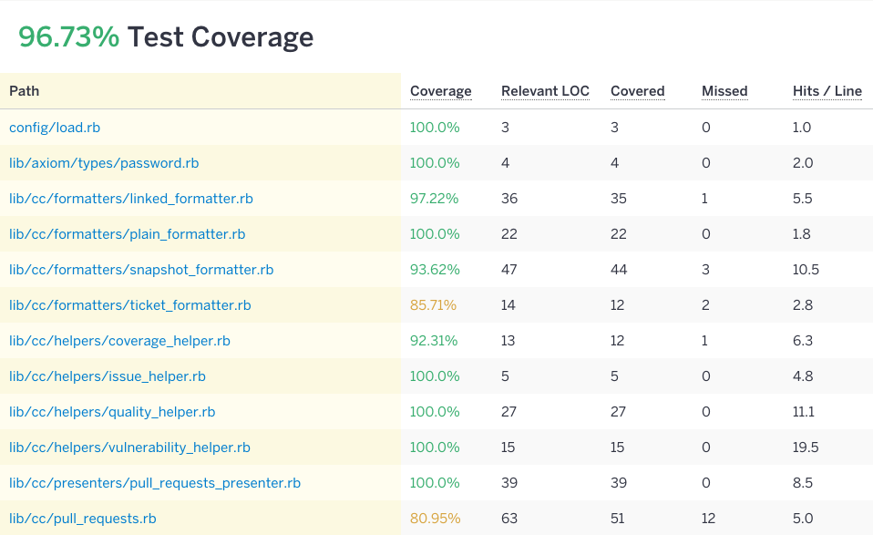
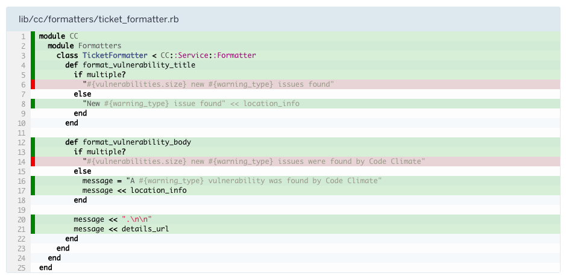

## Coverage Reports

In addition to [continuous integration](#continuous-integration), many teams opt
to generate coverage reports. Coverage reports are generated by running
alongside your test suite, and monitoring which lines in your application are
executed. This produces reports allowing you to visualize the frequency in which
each line is hit, along with high level statistics about each file.

As you can probably guess, you're looking to _approach_ 100% coverage, but take
note that pursuit of this metric brings diminishing returns. As with most things
in life, there is nuance, and you may have to make trade-offs.

Furthermore, you want to minimize the `Hits / Line` (see figure 3.1). If you are
testing the same code path 50+ times, it's a good sign that you may be
over-testing, which could lead to brittle tests. In a perfect world, you'd have
100% coverage and only hit each line a single time.

Figure 3.2 shows each executed line in green, and lines that the test suite did
not touch in red. Lines in red are a good target for new tests.

Coverage reports can be generated in a few ways. They can be generated locally
or [on CI](https://circleci.com/docs/code-coverage/) with the
[simplecov](https://github.com/colszowka/simplecov) gem. Alternatively, you can
rely on third party services, such as [Coveralls](https://coveralls.io/) or
[Code Climate](https://codeclimate.com/).
