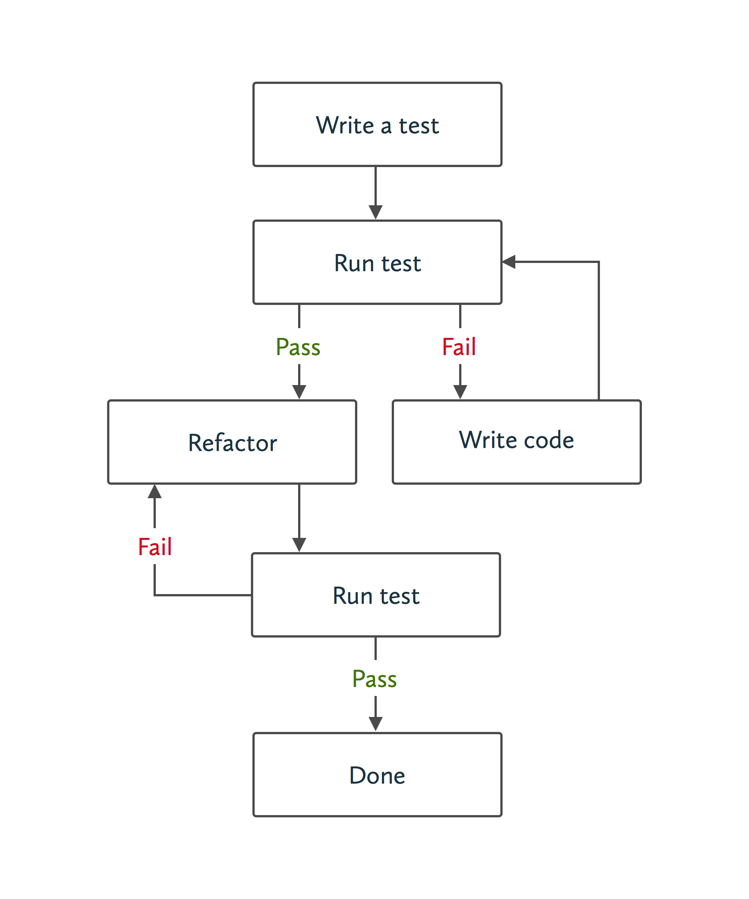

% Testing Rails
% Josh Steiner
% Joël Quenneville

\clearpage

\mainmatter

# Introduction

## Why test?

As software developers, we are hired to write code that _works_.
If our code doesn't work, we have failed.

So how do we ensure correctness?

One way is to manually run your program after writing it. You write a new
feature, open a browser, click around to see that it works, then continue adding
more features. This works while your application is small, but at some point
your program has too many features to keep track of. You write some new code,
but it unexpectedly breaks old features and you might not even know it. This is
called a **regression**. At one point your code worked, but you later introduced
new code which broke the old functionality.

A better way is to have the computer check our work. We write software to
automate our lives, so why not write programs to test our code as well?
**Automated tests** are scripts that output whether or not your code works
as intended. They verify that our program works now, and will continue to work
in the future, without humans having to test it by hand. Once you write a test,
you should be able to reuse it for the lifetime of the code it tests, although
your tests can change as expectations of your application change.

Any large scale and long lasting Rails application should have a comprehensive
test suite. A **test suite** is the collection of tests that ensure that your
system works. Before marking any task as "complete" (i.e. merging into the
`master` branch of your Git repository), it is imperative to run your entire
test suite to catch regressions. If you have written an effective test suite,
and the test suite passes, you can be confident that your entire application
behaves as expected.

A test suite will be comprised of many different kinds of tests, varying in
scope and subject matter. Some tests will be high level, testing an entire
feature and walking through your application as if they were a real user. Others
may be specific to a single line of code. We'll discuss the varying flavors of
tests in detail throughout this book.

### Saving Time and Money

At the end of the day, testing is about saving time and money. Automated tests
catch bugs sooner, preventing them from ever being deployed. By reducing the
manpower necessary to test an entire system, you quickly make up the time it
takes to implement a test in the first place.

Automated tests also offer a quicker feedback loop to programmers, as they don't
have to walk through every path in their application by hand. A well written
test can take milliseconds to run, and with a good development setup you don't
even have to leave your editor. Compare that to using a manual approach a
hundred times a day and you can save a good chunk of time. This enables
developers to implement features faster because they can code confidently
without opening the browser.

When applications grow without a solid test suite, teams are often discouraged
by frequent bugs quietly sneaking into their code. The common solution is
to hire dedicated testers; a Quality Assurance (QA) team. This is an expensive
mistake. As your application grows, now you have to scale the number of hands on
deck, who will never be as effective as automated tests at catching regressions.
QA increases the time to implement features, as developers must communicate back
and forth with another human. Compared to a test suite, this is costly.

This is not to say that QA is completely useless, but they should be hired in
addition to a good test suite, not as a replacement. While manual testers are
not as efficient as computers at finding regressions, they are much better at
validating subjective qualities of your software, such as user interfaces.

### Confidence

Having a test suite you can trust enables you do things you would otherwise not
be able to. It allows you to make large, sweeping changes in your codebase
without fearing you will break something. It gives you the confidence to deploy
code at 5pm on a Friday. Confidence allows you to move faster.

### Living Documentation

Since every test covers a small piece of functionality in your app, they serve
as something more than just validations of correctness. Tests are a great form
of living documentation. Since comments and dedicated documentation are
decoupled from your code, they quickly go stale as you change your application.
Tests must be up to date, or they will fail. This makes them the second best
source of truth, after the code itself, though they are often easier to read.
When I am unsure how a piece of functionality works, I'll look first at the test
suite to gain insight into how the program is supposed to behave.

## Test Driven Development

Automated tests are likely the best way to achieve confidence in a growing
codebase. To amplify that confidence and achieve bigger wins in time savings and
code cleanliness, we recommend writing code using a process called **Test Driven
Development** (TDD). TDD is a process that uses tests to _drive_ the design and
development of your application. It begins with a development cycle called
**Red, Green, Refactor**.

### Red, Green, Refactor

Red, Green, Refactor is a series of steps that lead you through developing a
given feature or fixing a bug:

#### Red

Write a test that covers the functionality you would like to see implemented.
You don't have to know what your code looks like at this point, you just have to
know what it will do. Run the test. You should see it fail. Most test runners
will output red for failure and green for success. While we say "failure" do not
take this negatively. It's a good sign! By seeing the test fail first, we know
that once we make it pass, our code works.

#### Green

Read the error message from the failing test, and write as little code as
possible to fix the current error message. By only writing enough code to see
our test pass, we tend to write less code as a whole. Continue this process
until the test passes. This may involve writing intermediary features covering
lower level functionality which require their own Red, Green, Refactor cycle.

Do not focus on code quality at this point. Be shameless! We simply want to get
our new test passing. This may involve returning literal values from methods,
which will force you to write additional tests to cover all cases.

#### Refactor

Clean up your code, reducing any duplication you may have introduced. This
includes your code _as well as your tests_. Treat your test suite with as much
respect as you would your live code, as it can quickly become difficult to
maintain if not handled with care. You should feel confident enough in the tests
you've written that you can make your changes without breaking anything.



### TDD Approaches

When solving problems with TDD, you must decide where to start testing your
code. Should you start from a high level, testing how the user interacts with
the system, then drill down to the nitty gritty? Or, should you begin with a low
level design and progress outwards to the final feature? The answer to this
depends, and will vary person-to-person and feature-to-feature.

#### Outside-In Development

Outside-In Development starts from the highest level of abstraction first.
Typically, this will be from the perspective of the user walking through the
application in their browser and interacting with elements on the page. We call
this an acceptance test, as it ensures that the behavior of the program is
acceptable to the end user.

As we develop the feature, we'll gradually need to implement more granular
functionality, necessitating intermediate level and lower level tests. These
lower level tests may check a single conditional or return value.

By working inwards instead of outwards, you ensure that you never write more
code than necessary, because there is a clear end. Once the acceptance test
is green, there is no more code to write!

Working outside-in is desirable when you have a good understanding of the
problem, and have a rough understanding of how the interface and code will work
ahead of time. Because you are starting from a high level, your code will not
work until the very end, however your first test will guide your design all the
way to completion. You have to trust that your test will bring you there
successfully.

#### Inside-Out Development

Sometimes you don't know what your end solution will look like, so it's better
to use an inside-out approach. An inside-out approach helps you build up your
code component by component. At each step of the way you will get a larger
piece of the puzzle working and your program will be fully functioning at the
end of each step. By building smaller parts, one at a time, you can change
directions as you get to higher-level components after you build a solid
lower-level foundation.

### Test Driven vs. Test First

Just because you write your test first, does not mean you are using test driven
development. While following the Red, Green, Refactor cycle, it's important to
write code only in response to error messages that are provided by test
failures. This will ensure that you do not overengineer your solution or
implement features that are not tested.

It's also important not to skip the refactor step. This is one of the most
important parts of TDD, and ensures that your code is maintainable and easy to
change in the future.

### Benefits of TDD

#### Confidence

When it comes down to it, TDD is all about confidence. By writing tests _after_
your production code, it's all too easy to forget to test a specific code path.
Writing your tests first and only writing code in response to a failing test,
you can trust that all of our production code is covered. This confidence gives
you power to quickly and easily change your code without fear of it breaking.

#### Time Savings

Consider automated tests an investment. At first, you will add time by writing
tests you would otherwise not be writing. However, most real applications don't
stay the same; they grow. An effective test suite will keep your code honest,
and save you time debugging over the lifetime of the project. The time savings
grow as the project progresses.

TDD can also lead to time savings over traditional testing. Writing your test up
front gives you useful error messages to follow to a finished feature. You save
time thinking of what to do next, because your test tells you!

#### Flow

It isn't uncommon for developers to reach a state of "flow" when developing
with TDD. Once you write your test, the test failures continuously tell you what
to do next, which can almost make programming seem robotic.

#### Improved Design

That TDD itself improves design is arguable (and many have argued it). In
reality, a knowledge of object oriented design principles paired with TDD
aids design. TDD helps you recognize coupling up front. Object oriented design
principles, like dependency injection, help you write your code in ways that
reduce this coupling, making your code easier to test. It turns out that code
that is easy to test happens to align with well structured code. This makes
perfect sense, because our tests run against our code and good code is reusable.

### A Pragmatic Approach

There's a lot of dogmatism surrounding the exercise of TDD. We believe that TDD
is often the best choice for all the reasons above; however, you must always
consider the tradeoffs. Sometimes, TDD doesn't make sense or simply isn't worth
it. In the end, the most important thing is that you can feel confident that
your program works as it should. If you can achieve that confidence in other
ways, that's great!

Here are some reasons you might _not_ test drive, or even test, your code:

* The feature you are trying to implement is outside your wheelhouse, and you
  want to code an exploratory version before you can write your test. We call a
  quick implementation like this a spike. After writing your spike, you may
  then choose to implement the associated test. If you implement the test after
  your production code, you should at the very least toggle some code that would
  make it fail in an expected way. This way, you can be certain it is testing the
  correct thing.  Alternatively, you may want to start from scratch with your new
  knowledge and implement it as part of a TDD cycle.
* The entire program is small or unlikely to change. If it's small enough to test
  by hand efficiently, you may elect to forego testing.
* The program will only be used for a short time. If you plan to throw out the
  program soon, it will be unlikely to change enough to warrant regression
  testing, and you may decide not to test it.
* You don't care if the program doesn't behave as expected. If the program is
  unimportant, it may not be worth testing.

## Characteristics of an Effective Test Suite

The most effective test suites share the following characteristics.

### Fast

The faster your tests are, the more often you can run them. Ideally, you can run
your tests after every change you make to your codebase. Tests give you the
feedback you need to change your code. The faster they are the faster you can
work and the sooner you can deliver a product.

When you run slow tests, you have to wait for them to complete. If they are slow
enough, you may even decide to take a coffee break or check Twitter. This
quickly becomes a costly exercise. Even worse, you may decide that running tests
is such an inconvenience that you stop running your tests altogether.

### Complete

Tests cover all public code paths in your application. You should not be able to
remove publicly accessible code from your production app without seeing test
failures. If you aren't sufficiently covered, you can't make changes and be
confident they won't break things. This makes it difficult to maintain your
codebase.

### Reliable

Tests do not wrongly fail or pass. If your tests fail intermittently or you get
false positives you begin to lose confidence in your test suite. Intermittent
failures can be difficult to diagnose. We'll discuss some common symptoms later.

### Isolated

Tests can run in isolation. They set themselves up, and clean up after
themselves. Tests need to set themselves up so that you can run tests
individually. When working on a portion of code, you don't want to have to waste
time running the entire suite just to see output from a single test. Tests that
don't clean up after themselves may leave data or global state which can lead to
failures in other tests when run as an entire suite.

### Maintainable

It is easy to add new tests and existing tests are easy to change. If it is
difficult to add new tests, you will stop writing them and your suite becomes
ineffective. You can use the same principles of good object oriented design to
keep your codebase maintainable. We'll discuss some of them later in this book.

### Expressive

Tests are a powerful form of documentation because they are always kept up to
date. Thus, they should be easy enough to read so they can serve as said
documentation. During the refactor phase of your TDD cycle, be sure you remove
duplication and abstract useful constructs to keep your test code tidy.

## Example Application

This book comes with a bundled [example application], a Reddit clone called
Reddat. If you are unfamiliar with Reddit, it is an online community for posting
links and text posts. People can then comment on and upvote those posts. Ours
will be a simplified version with no users (anyone can post) and only link
posts. Make sure that you sign into GitHub before attempting to view the example
application and commit links, or you'll receive a 404 error.

[example application]: https://github.com/thoughtbot/testing-rails/tree/master/example_app

Most of the code samples included in the book come directly from commits in the
example application. At any point, you can check out the application locally and
check out those commits to explore solutions in progress.  For some solutions,
the entire change is not included in the chapter for the sake of focus and
brevity. However, you can see every change made for a solution in the example
commits.

The book is broken into chapters for specific topics in testing, which makes it
easier to use as a reference and learn about each part step by step. However,
it does make it more challenging to see how a single feature is developed that
requires multiple types of tests. To get a sense of how features develop
naturally please check out the app's [commit history] to see the code evolve one
feature at a time. Additionally, you'll find more tests to learn from that we
won't cover in the book.

[commit history]: https://github.com/thoughtbot/testing-rails/commits/master/example_app

Make sure to take a look at the application's [README], as it contains a summary
of the application and instructions for setting it up.

[README]: https://github.com/thoughtbot/testing-rails/blob/master/example_app/README.md

## RSpec

We'll need a testing framework in order to write and run our tests. The
framework we choose determines the format we use to write our tests, the
commands we use to execute our tests, and the output we see when we run our
tests.

Examples of such frameworks include Test::Unit, Minitest, and RSpec. Minitest is
the default Rails testing framework, but we use RSpec for the mature test runner
and a syntax that encourages human readable tests. RSpec provides a Domain
Specific Language (DSL) specifically written for test writing that makes reading
and writing tests feel more natural. The gem is called RSpec, because the tests
read like specifications. They describe _what_ the software does and how the
interface should behave. For this reason, we refer to RSpec tests as _specs_.

While this book uses RSpec, the content will be based in theories and practice
that you can use with any framework.

### Installation

When creating new apps, we run `rails new` with the `-T` flag to avoid creating
any Minitest files. If you have an existing Rails app and forgot to pass that
flag, you can always remove `/test` manually to avoid having an unused folder in
your project.

Use [`rspec-rails`] to install RSpec in a Rails app, as it configures many of
the things you need for Rails testing out of the box. The plain ol'
[`rspec`] gem is used for testing non-Rails programs.

[`rspec-rails`]: https://github.com/rspec/rspec-rails
[`rspec`]: https://github.com/rspec/rspec

Be sure to add the gem to *both* the `:development` and `:test` groups in your
`Gemfile`. It needs to be in `:development` to expose Rails generators and rake
tasks at the command line.

```ruby
group :development, :test do
  gem 'rspec-rails', '~> 3.0'
end
```

Bundle install:

```
bundle install
```

Generate RSpec files:

```
rails generate rspec:install
```

This creates the following files:

* [`.rspec`](https://github.com/thoughtbot/testing-rails/blob/b86752a0690a2800c6f57e23974bfe11c8b5fe28/example_app/.rspec)

    Configures the default flags that are passed when you run `rspec`. The line
    [`--require spec_helper`] is notable, as it will automatically require the spec
    helper file for every test you run.

[`--require spec_helper`]: https://github.com/thoughtbot/testing-rails/blob/b86752a0690a2800c6f57e23974bfe11c8b5fe28/example_app/.rspec#L2

* [`spec/spec_helper.rb`](https://github.com/thoughtbot/testing-rails/blob/b86752a0690a2800c6f57e23974bfe11c8b5fe28/example_app/spec/spec_helper.rb)

    Further customizes how RSpec behaves. Because this is loaded in every test,
    you can guarantee it will be run when you run a test in isolation. Tests run
    in isolation should run near instantaneously, so be careful adding any
    dependencies to this file that won't be needed by every test.  If you have
    configurations that need to be loaded for a subset of your test suite,
    consider making a separate helper file and load it only in those files.

    At the bottom of this file is a comment block the RSpec maintainers suggest
    we enable for a better experience. We agree with most of the customizations.
    I've [uncommented them], then [commented out a few specific settings] to
    reduce some noise in test output.

[uncommented them]: https://github.com/thoughtbot/testing-rails/commit/572ddcebcf86c74687ced40ddb0aad234f6e9657
[commented out a few specific settings]: https://github.com/thoughtbot/testing-rails/commit/1c5e29def9e64d4e67abb5a0867c67348468ab5b


* [`spec/rails_helper.rb`](https://github.com/thoughtbot/testing-rails/blob/b86752a0690a2800c6f57e23974bfe11c8b5fe28/example_app/spec/rails_helper.rb)

    A specialized helper file that loads Rails and its dependencies. Any file that
    depends on Rails will need to require this file explicitly.

The generated spec helpers come with plenty of comments describing what each
configuration does. I encourage you to read those comments to get an idea of how
you can customize RSpec to suit your needs. I won't cover them as they tend to
change with each RSpec version.

# Types of Tests

## The Testing Pyramid

The various test types we are about to look at fall along a spectrum. At one end
are **unit tests**. These test individual components in isolation, proving that
they implement the expected behavior independent of the surrounding system.
Because of this, unit tests are usually small and fast.

In the real world, these components don't exist in a vacuum: they have to
interact with each other. One component may expect a collaborator to have a
particular interface when in fact it has completely different one. Even though
all the tests pass, the software as a whole is broken.

This is where **integration tests** come in. These tests exercise the system as
a whole rather than its individual components. They typically do so by
simulating a user trying to accomplish a task in our software. Instead of being
concerned with invoking methods or calling out to collaborators, integration
tests are all about clicking and typing as a user.

Although this is quite effective for proving that we have working software, it
comes at a cost. Integration tests tend to be much slower and more brittle than
their unit counterparts.

Many test types are neither purely unit nor integration tests. Instead, they lie
somewhere in between, testing several components together but not the full
system.


We like to build our test suite using a combination of these to create a
[**testing pyramid**](http://martinfowler.com/bliki/TestPyramid.html). This is a
suite that has a few high-level integration tests that cover the general
functionality of the app, several intermediate-level tests that cover a
sub-system in more detail, and many unit tests to cover the nitty-gritty details
of each component.

This approach plays to the strength of each type of test while attempting to
minimize the downsides they have (such as slow run times).

## Feature Specs

Feature specs simulate a user opening your app in a browser and interacting with
the page. Since they test that the application works for the end user, they are
considered a form of **acceptance tests**, and you may hear them referred to as
such. When developing a new feature and practicing outside-in development, this
is where we'll typically start.

### Submitting a link post

For our first feature, we're going to allow users to create a link post. To do
this they'll have to click on a link from the home page, fill in the title and
URL of the link, and click "Submit". We'll test that once they do all that, they
see the title they entered on the page, and it should link to the URL they
provided.

As we're using TDD, we'll start with a test describing the functionality we'd
like to see. Let's start with some pseudocode:

```
As a user
When I visit the home page
And I click "Submit a link post"
And I fill in my title and URL
And I click "Submit"
Then I should see the title on the page
And it should link to the given URL
```

One thing to note is that we start our description with _who_ the end user is
for this test. Our app will only have a single role, so it's safe to use `user`,
however many applications will need to differentiate unauthenticated users
(often visitors), admins, or domain specific users roles (like a _coach_ or
_player_).

#### Capybara

In order for our tests to be able to interact with the browser, we have to
install a gem called [Capybara]. Capybara is an API for interacting with the
browser. It provides methods to visit pages, fill in forms, click buttons, and
more.

[Capybara]: https://github.com/jnicklas/capybara

Add it to your Gemfile and `bundle install`:

```ruby
gem "capybara"
```

Require it from your `rails_helper`:

```ruby
require "capybara/rails"
```

#### The test

With that installed, we're ready to write our spec. Take a look at the completed
version. We'll go through it line by line:

```ruby
# spec/features/user_submits_a_link_spec.rb
require "rails_helper"

RSpec.feature "User submits a link" do
  scenario "they see the page for the submitted link" do
    link_title = "This Testing Rails book is awesome!"
    link_url = "http://testingrailsbook.com"

    visit root_path
    click_on "Submit a new link"
    fill_in "link_title", with: link_title
    fill_in "link_url", with: link_url
    click_on "Submit!"

    expect(page).to have_link link_title, href: link_url
  end
end
```

Create a new file at `spec/features/user_submits_a_link_spec.rb`.

We'll first require our `rails_helper.rb`, as this will include our Rails
environment and Capybara:

```ruby
require "rails_helper"
```

Next, our feature block:

```ruby
RSpec.feature "User submits a link" do
  ...
end
```

`.feature` is a method that's provided by Capybara. By using it, you have access
to all of Capybara's methods for interacting with the page. You may see
examples elsewhere calling `.feature` in the global context. This is
because old versions of RSpec used monkeypatching to define top level methods on
`main` and `Module`. We disabled this functionality by [commenting in]
`config.disable_monkey_patching!`, as this will be the default functionality in
future versions of RSpec.

[commenting in]: https://github.com/thoughtbot/testing-rails/blob/e03ef3ca8150d8d28c4cdf760f53d11070447b67/example_app/spec/spec_helper.rb#L53

`.feature` takes a string, which you use to describe your feature. We'll usually
name this the same thing as we named our file and create a new file for every
feature. It gets printed out when we run our specs in `documentation` format.

Inside our feature block, we have a `#scenario` block:

```ruby
scenario "they see the page for the submitted link" do
  ...
end
```

This is the container for a single specification. It describes one potential
outcome of the user creating a link. Like the feature block, we pass it a string
which we'll see in our output when we run our spec. The name for the scenario
should be a continuation of the string used for the feature block. When read
together, they should construct a sentence-like structure so that they read well
when we run our specs.

Now for the spec itself!

We first define a couple variables for our title and URL:

```ruby
link_title = "This Testing Rails book is awesome!"
link_url = "http://testingrailsbook.com"
```

Next, visit the homepage:

```ruby
visit root_path
```

Pretty straightforward. `visit` is a method provided by Capybara which will
visit `root_path` as defined by your application. Astute readers will realize
that we have not yet defined `root_path`. `root_path` is undefined, because
this is a brand new application. We're making this up, as we expect there to be
some root route of the application, and we know enough about Rails to know that
Rails convention will name it `root_path` once it is defined.

Use Capybara to click a link. This link will bring us to a new page to fill in
our form:

```ruby
click_on "Submit a new link"
```

Fill in the form fields:

```ruby
fill_in "link_title", with: link_title
fill_in "link_url", with: link_url
```

If you guessed that `#fill_in` was from Capybara, you'd be right! `#fill_in`
finds a method by its name, id, or label and fills it in with the given text. In
this case, we're using the ids `link_title` and `link_url`. While we are using
ids, note that Capybara does not expect you to add a `#` to the beginning of
your id as you would with CSS.

The fields we are looking for don't exist yet, but they will soon. We're using
Rails convention over configuration here to guess what the fields are going to
be called. We know that Rails gives ids to all fields by joining the model name
and the field name. As long as we don't customize those, we can use them to our
advantage.

Even if you didn't know that, once we get around to running the test, you'd see
it fail because it couldn't find a field with that name, id, or label. At that
point, you could open the page in your browser, inspect the element to see what
the id is for real, and replace it here.

With the fields filled in, we can submit the form!

```ruby
click_on "Submit!"
```

And, finally, the assertion:

```ruby
expect(page).to have_link link_title, href: link_url
```

There's a lot going on here, including some "magic", so let's go through each of
the components. While this syntax may look strange, remember that RSpec is just
Ruby code. This could be rewritten as such:

```ruby
expect(page).to(have_link(link_title, { href: link_url }))
```

`#expect` is an RSpec method that will build an assertion. It takes one value,
which we will run an assertion against. In this case it's taking the `page`
object, which is a value provided by Capybara that gives access to the currently
loaded page. To run the assertion, you call `#to` on the return value of
`#expect` and pass it a **matcher**. The matcher is a method that returns truthy
or falsy when run through our assertion. The matcher we've passed here is
`#have_link`. `#have_link` comes from Capybara, and returns true if it finds a link
with the given text on the page. In this case we also pass it a `href` option so
it checks against the link's URL.

So now for the magic. `#have_link` doesn't actually exist. RSpec defines
matchers automatically for methods that start with `has_` and end with `?`.
Capybara defines the method `#has_link?` on the `page` object, so we could think
of this whole line as raising an error if `page.has_link?(...)` returns false.
RSpec will automatically look for the method `#has_link?` when it sees
`#have_link`.

If you've found all this a bit complex, don't worry. How it works is less
important than being able to write assertions using the syntax. We'll be writing
a lot of tests, so the syntax will soon become familiar.

Take a look at the [rspec-expectations] gem to see all of the built-in matchers.

[rspec-expectations]: https://github.com/rspec/rspec-expectations

#### Running our spec

Now that our spec is written, we have to run it! To run it, find your command
line and enter `rspec`. `rspec` will look in our `spec` directory and run all of
the files that end in `_spec.rb`. For now, that's a single file and a single
test.

You should see something like this:

```
User submits a link
  they see the page for the submitted link (FAILED - 1)

Failures:

  1) User submits a link they see the page for the submitted link
     Failure/Error: visit root_path
     NameError:
       undefined local variable or method `root_path' for
         #<RSpec::ExampleGroups::UserSubmitsALink:0x007f9a2231fe98>
       ./spec/features/user_submits_a_link_spec.rb:8:in
         `block (2 levels) in <top (required)>'

Finished in 0.00183 seconds (files took 2.53 seconds to load)
1 example, 1 failure

Failed examples:

rspec ./spec/features/user_submits_a_link_spec.rb:4 # User submits a link they
  see the page for the submitted link

Randomized with seed 5573
```

Let's go through this bit by bit:

```
User submits a link
  they see the page for the submitted link (FAILED - 1)
```

This is the summary of all the tests we ran. It uses the names provided in our
`.feature` and `#scenario` block descriptions. Note that here we read these names
together, which is why we wrote them to read nicely together. We see that the
scenario `they see the page for the submitted link` failed.

The format we see here is called `documentation` and is due to our
configuration in our `spec_helper.rb`. When we run a single spec file, it gives
the output it an expressive format. When we run multiple spec files, this format
can become cumbersome with all the output, so it uses a more concise `dot`
syntax. We'll see that soon.

```
Failures:

  1) User submits a link they see the page for the submitted link
     Failure/Error: visit root_path
     NameError:
       undefined local variable or method `root_path' for
         #<RSpec::ExampleGroups::UserSubmitsALink:0x007f9a2231fe98>
       ./spec/features/user_submits_a_link_spec.rb:8:in
         `block (2 levels) in <top (required)>'
```

This section outlines all of the failures. You will see one failure for each
spec that failed. It outputs the error message, the line that failed, and the
backtrace. We'll look at this in more detail in a second.

```
Finished in 0.00183 seconds (files took 2.53 seconds to load)
1 example, 1 failure
```

Next is a summary of the tests that were run, giving you the total time to run
and the number of tests that were run and that failed.

```
Failed examples:

rspec ./spec/features/user_submits_a_link_spec.rb:4 # User submits a link they
see the page for the submitted link
```

This section outputs the command to run each of the failing specs, for easy copy
and pasting. If you initially run your entire suite with `rspec` and want to
focus in on a single failing test, you can copy this line and enter it into your
terminal to run just that spec. `rspec` takes one or multiple files and will
even parse line numbers as you see above by passing the filename with the line
number at the end (`rspec ./path/to/file:5` if you wanted to run the spec on
line `5`).

```
Randomized with seed 5573
```

Finally, we see the seed we ran our specs with. We run our specs in a random
order to help diagnose specs that may not clean up after themselves properly.
We'll discuss this in more detail in our section on intermittent failures.

#### Passing our test

Now that we know how to read the RSpec output, let's pass our test. To do this,
we'll read the error messages one at a time and write only enough code to make
the current error message pass.

The first error we saw looked like this:

```
Failure/Error: visit root_path
NameError:
  undefined local variable or method `root_path' for
    #<RSpec::ExampleGroups::UserSubmitsALink:0x007f9a2231fe98>
  ./spec/features/user_submits_a_link_spec.rb:8:in
    `block (2 levels) in <top (required)>'
```

It looks like `root_path` is undefined. This helper method comes from Rails when
you define the route in `config/routes.rb`. We want our homepage to show all of
the links that have been submitted, so it will point to the `index` action of
our `LinksController`:

```ruby
root to: "links#index"
```

This is the smallest amount of code we can write to fix that error message.
Run the test again:

```
Failure/Error: visit root_path
ActionController::RoutingError:
  uninitialized constant LinksController
```

Okay, we need to define our `LinksController`. In
`app/controllers/links_controller.rb`:

```ruby
class LinksController
end
```

Define the controller class. We get this failure:

```
Failure/Error: visit root_path
NoMethodError:
  undefined method `action' for LinksController:Class
```

Hmm, so this one's a bit more cryptic. It's saying that `action` is undefined
for our new `LinksController` class. This one requires a bit of Rails knowledge
to debug. If you are familiar with Rails, you know that `action` is the word we
use to refer to a routable method, specific to controllers. So, what makes a
controller different from other classes? Well, it needs to inherit from
`ApplicationController`.

```ruby
class LinksController < ApplicationController
```

Run the test again:

```
Failure/Error: visit root_path
AbstractController::ActionNotFound:
  The action 'index' could not be found for LinksController
```

Okay, let's define that method in our controller (remember that `action` is
Rails lingo for a method in a controller that can be routed to):

```ruby
def index
end
```

```
Failure/Error: visit root_path
ActionView::MissingTemplate:
  Missing template links/index, application/index with {:locale=>[:en],
    :formats=>[:html], :variants=>[], :handlers=>[:erb, :builder, :raw, :ruby,
    :coffee]}. Searched in:
      * "/Users/jsteiner/code/thoughtbot/testing-behind/app/views"
```

We're missing our template! It tells us all the places it looked and the formats
it looked for. In this case it's looking for an HTML template at `links/index`.

We can create an empty file there for now:

```
mkdir app/views/links
touch app/views/links/index.html.erb
```

Rerun the test:

```
Failure/Error: click_on "Submit a new link"
Capybara::ElementNotFound:
  Unable to find link or button "Submit a new link"
```

`app/views/links/index.html.erb` needs a link that reads "Submit a new link". We
know it's going to go to our new link page:

```
<%= link_to "Submit a new link", new_link_path %>
```

The new failure:

```
Failure/Error: visit root_path
ActionView::Template::Error:
  undefined local variable or method `new_link_path' for
    #<#<Class:0x007ff23228ee58>:0x007ff232226088>
```

Now we're missing a route for new new link page. Define it in
`config/routes.rb`:

```ruby
resources :links, only: [:new]
```

Note here that we limit which routes are created with `only`. This will prevent
us from having routes that we don't yet support.

Rerunning the test we get a familiar error.

```
Failure/Error: click_on "Submit a new link"
AbstractController::ActionNotFound:
  The action 'new' could not be found for LinksController
```

At this point, I hope you understand the process we use to develop our features.
You may now understand why having fast tests is important, as you can see we run
them a lot!

Now, do we really run them after every single small code change? Sometimes. Not
always. As you become more experienced with TDD, you'll find that you can predict
the output your tests will give as you develop a feature. Once you can do that,
you can skip some test runs while still only writing code to pass the test that
would have appeared. This allows you to practice TDD while saving some time.
However, it is imperative that you only write code in response to the test that
would have failed. If you can't accurately predict what failure message you'll
see, you should run the tests.

I'll leave the implementation of the rest of this feature as an exercise for the
reader. Take a peak at [my commit] if you get stuck.

[my commit]: https://github.com/thoughtbot/testing-rails/commit/c20b7009e46454070e87156a9947be39f08040f9

### Submitting an invalid link

All links should have a title and URL, so we should prevent users from
submitting invalid links. Since this is part of the "User submits a link"
feature, we can add it to the same feature block under a different scenario. A
basic feature spec might look like this:

```ruby
# spec/features/user_submits_a_link_spec.rb
context "the form is invalid" do
  scenario "they see a useful error message" do
    link_title = "This Testing Rails book is awesome!"

    visit root_path
    click_on "Submit a new link"
    fill_in "link_title", with: link_title
    click_on "Submit!"

    expect(page).to have_content "Url can't be blank"
  end
end
```

This test intentionally leaves the URL blank, and expects to see an error
message on the page for the missing URL. While we could test every possible path
(without a title, without a URL, without both), we really only need to test one
at an integration level. This will assure us that an error message renders if the
link is invalid. To ensure that each of our fields are valid, we instead test
this at the model layer. You can see how I tested this in the [respective
commit], but we won't cover model specs until the next chapter.

[respective commit]: https://github.com/thoughtbot/testing-rails/commit/5ed3981619066bb71c1b8f4b17647c57aebd2707

There are a couple new methods in this test. The first is `#context`. As you
might guess, it allows you to provide additional context to wrap one or more
scenarios. In fact, you can even nest additional context blocks, however we
recommend against that. Specs are much easier to read with minimal nesting. If
you need to nest scenarios more than a couple levels deep, you might consider
pulling out a new feature file.

The other new method is `#have_content`. Like `#have_link`, this method comes
from Capybara, and is actually `#has_content?`. `#has_content?` will look on the
page for the given text, ignoring any HTML tags.

#### Passing the test

As always, I'll run the test now and follow the error messages to a solution.
I'll leave this up to the reader, but feel free to check out [the commit] to see
what I did.

[the commit]: https://github.com/thoughtbot/testing-rails/commit/5ed3981619066bb71c1b8f4b17647c57aebd2707

#### Four Phase Test

You'll note that in each of our tests so far, we've used some strategic spacing.
This spacing is meant to make the tests easier to read by sectioning it into
multiple phases. The pattern here is modeled after the [Four Phase Test], which
takes the form:

[Four Phase Test]: http://xunitpatterns.com/Four%20Phase%20Test.html

```
test do
  setup
  exercise
  verify
  teardown
end
```

**Setup**

During setup, we create any objects that your test depends on.

**Exercise**

During exercise, we execute the functionality we are testing.

**Verify**

During verify, we check our expectations against the result of the exercise
phase.

**Teardown**

During teardown, we clean-up after ourselves. This may involve resetting the
database to it's pre-test state or resetting any modified global state. This is
usually handled by our test framework.

Four phase testing is more prominently used with model and unit tests, however
it is still useful for our acceptance tests. This is especially true for simple
tests like the two we've demonstrated, however some acceptance tests may be
large enough to warrant even more grouping. It's best to use your discretion and
group things into logical sections to make code easier to read.

### Viewing the homepage

Now that we can create links, we should test that we actually see them on the
homepage. Again, we'll start with some pseudocode:

```
As a user
Given a link has already been submitted
When I visit the home page
Then I should see the link's title on the page
And it should link to the correct URL
```

This test is a little different than our last. This time we have a "given".
Instead of creating a link ourselves, we're going to assume one already exists.
The reason behind this is simple. Walking through our application with Capybara
is slow. We shouldn't do it any more than we have to. We've already tested that
we can submit a link, so we don't need to test it again. Instead, we can create
records directly in the database.

We could go about creating records the way you'd expect:

```ruby
link = Link.create(title: "Testing Rails", url: "http://testingrailsbook.com")
```

This _would_ work, but it has some serious downfalls when using it to test
software. Imagine we have a large application, with hundreds of tests, each one
having created a `Link` the manual way. If we were to add a required field to
links, we would have to go through all of our tests and add the required field
for _all_ of these tests to get them to pass again. There are two widely used
fixes for this pain point. The first one is called fixtures.

#### Fixtures

Fixtures allow you to define sample data in YAML files that you can
load and reuse through your tests. It might look something like this:


```yaml
# fixtures/links.yml
testing_rails:
  title: Testing Rails
  url: http://testingrailsbook.com
```

```ruby
# In your test
link = links(:testing_rails)
```

Now that we've extracted the definition of our _Testing Rails_ link, if our
model adds new required fields we only have to update our fixtures file. This is
a big step up, but we still see some problems with this solution.

For one, fixtures are a form of **Mystery Guest**. You have a Mystery Guest when
data used by your test is defined outside the test, thus obscuring the cause and
effect between that data and what is being verified. This makes tests harder to
reason about, because you have to hunt down another file to be able to
understand the entirety of what is happening.

As applications grow, you'll typically need variations on each of your models
for different situations. For example, you may have a fixture for every user
role in your application, then even more users for different roles depending on
whether or not the user is a member of a specific organization. All these are
possible states a user can be in and grow the number of fixtures you will have to
recall.

#### FactoryGirl

We've found factories to be a better alternative to fixtures. Rather than
defining hardcoded data, factories define generators of sorts, with predefined
logic where necessary. You can override this logic directly when instantiating
the factories in your tests. They look something like this:

```ruby
# spec/factories.rb
FactoryGirl.define do
  factory :link do
    title "Testing Rails"
    url "http://testingrailsbook.com"
  end
end
```

```ruby
# In your test
link = create(:link)

# Or override the title
link = create(:link, title: "TDD isn't Dead!")
```

Factories put the important logic right in your test. They make it easy to see
what is happening at a glance and are more flexible to different scenarios you
may want to set up. While factories can be slower than fixtures, we think the
benefits in flexibility and readability outweigh the costs.

#### Installing FactoryGirl

To install FactoryGirl, add `factory_girl_rails` to your `Gemfile`:

```ruby
group :development, :test do
  ...
  gem "factory_girl_rails"
  ...
end
```

We'll also be using Database Cleaner:

```ruby
group :test do
  ...
  gem "database_cleaner"
  ...
end
```

Install the new gems and create a new file `spec/support/factory_girl.rb`:

```ruby
# spec/support/factory_girl.rb
RSpec.configure do |config|
  config.include FactoryGirl::Syntax::Methods

  config.before(:suite) do
    begin
      DatabaseCleaner.start
      FactoryGirl.lint
    ensure
      DatabaseCleaner.clean
    end
  end
end
```

This file will lint your factories before the test suite is run. That is, it
will ensure that all the factories you define are valid. While not necessary,
this is a worthwhile check, especially while you are learning. It's a quick way
to rest easy that your factories work. Since `FactoryGirl.lint` may end up
persisting some records to the database, we use Database Cleaner to restore the
state of the database after we've linted our factories. We'll cover Database
Cleaner in depth later.

Now, this file won't require itself! In your `rails_helper` you'll find some
commented out code that requires all of the files in `spec/support`. Let's
comment that in so our FactoryGirl config gets loaded:

```ruby
# Uncomment me!
Dir[Rails.root.join("spec/support/**/*.rb")].each { |f| require f }
```

Last, we need to create our factories file. Create a new file at
`spec/factories.rb`:

```ruby
FactoryGirl.define do
end
```

This is where we'll define our factory in the next section.

#### The test

With FactoryGirl set up, we can write our test. We start with a new file at
`spec/features/user_views_homepage_spec.rb`.

```ruby
require "rails_helper"

RSpec.feature "User views homepage" do
  scenario "they see existing links" do
  end
end
```

We require our `rails_helper` and create the standard feature and scenario
blocks.

```ruby
link = create(:link)
```

To setup our test, we create a link using FactoryGirl's `.create` method, which
instantiates a new `Link` object with our (currently non-existent) factory
definition and persists it to the database.

`.create` is loaded into the global context in `spec/support/factory_girl.rb`:

```
config.include FactoryGirl::Syntax::Methods
```

While we'll be calling `.create` in the global context to keep our code cleaner,
you may see people calling it more explicitly: `FactoryGirl.create`. This is
simply a matter of preference, and both are acceptable.

Now, we'll need to add a factory definition for our `Link` class in
`spec/factories.rb`:

```ruby
# spec/factories.rb
factory :link do
  title "Testing Rails"
  url "http://testingrailsbook.com"
end
```

We define a default title and URL to be created for all links created with
FactoryGirl. We only define defaults for fields that we [validate presence of]. If
you add more than that, your factories can become unmanageable as all of your
tests become coupled to data defined in your factories that isn't a default.
Not following this advice is a common mistake in Rails codebases and leads to
major headaches.

[validate presence of]: https://github.com/thoughtbot/testing-rails/commit/5ed3981619066bb71c1b8f4b17647c57aebd2707#diff-594e2b1fb48290a8f5f695da1c1e9318R2

The specific title and URL is unimportant, so we don't override the factories'
defaults. This allows us to focus on what is important and makes the test easier
to read.

```ruby
visit root_path

expect(page).to have_link link.title, href: link.url
```

Nothing novel here. Visit the homepage and assert that we see the title linking
to the URL.

#### Passing the test

This is left as an exercise for the reader. Feel free to check out the
[associated commit] to see what I did.

[associated commit]: https://github.com/thoughtbot/testing-rails/commit/944b0967232fe7bb623adbb36482ce3f76c7a037

### Voting on links

One of the most important parts of Reddit is being able to vote for posts. Let's
implement a basic version of this functionality in our app, where you can upvote
and downvote links.

Here's a basic test for upvoting links:

```ruby
# spec/features/user_upvotes_a_link_spec.rb
RSpec.feature "User upvotes a link" do
  scenario "they see an increased score" do
    link = create(:link)

    visit root_path

    within "#link_#{link.id}" do
      click_on "Upvote"
    end

    expect(page).to have_css "#link_#{link.id} [data-role=score]", text: "1"
  end
end
```

There are a couple new things in this test. First is the `within` block.
`within` takes a selector and looks for a matching element on the page. It then
limits the scope of everything within the block to elements inside the specified
element. In this case, our page has a potential to have multiple links or other
instances of the word "Upvote". We scope our finder to only look for that text
within the list element for our link. We use the CSS id `#link_#{link.id}` which
is given by `content_tag_for`.

The second new method is `has_css`, which asserts that a given selector is on
the page. With the `text` option, it ensures that the provided text is found
within the given selector. The selector I use includes a data attribute:
`[data-role=score]`. We'll frequently use `data-role`s to decouple our test
logic from our presentation logic. This way, we can change class names and tags
without breaking our tests!

## Model Specs

As you can probably guess, model specs are specs for testing your Rails models.
If you've written unit tests before, they may seem similar, although many model
specs will interact with the database due to the model's dependency on
ActiveRecord, so they are not truly unit tests.

### Instance Methods

In the last chapter, we added functionality for users to vote on links with some
instance methods on our `Link` class to help with this.

#### Link#upvote

The first method is `#upvote`, which increments the `upvotes` count on the
link by 1. A simple way to test this behavior is to instantiate an object with a
known upvote count, call our `#upvote` method, and then verify that the new
upvote count is what we expect. A test for that might look like this:

```ruby
# spec/models/link_spec.rb
RSpec.describe Link, "#upvote" do
  it "increments upvotes" do
    link = build(:link, upvotes: 1)

    link.upvote

    expect(link.upvotes).to eq 2
  end
end
```

`.describe` comes from RSpec and creates a group for whatever functionality you
are describing. It takes a subject, in our case the `Link` class, and the
behavior as a string. Typically, we'll use the name of our method, in this case
`#upvote`. We prefix instance methods with a `#` and class methods with a `.`.

```
link = build(:link, upvotes: 1)
```

`.build` is another FactoryGirl method. It's similar to `.create`, in that it
instantiates an object based on our factory definition, however `.build` does
not save the object. Whenever possible, we're going to favor `.build` over
`.create`, as persisting to the database is one of the slowest operations in our
tests. In this case, we don't care that the record was saved before we increment
it so we use `.build`. If we needed a persisted object (for example, if we
needed to query for it), we would use `.create`.

You might ask, "Why not use `Link.new`?". Even though we don't save our record
immediately, our call to `link.upvote` will, so we need a valid `Link`. Rather
than worrying about what attributes need to be set to instantiate a valid
instance, we depend on our factory definition as the single source of truth on
how to build a valid record.

Our _verify_ step is slightly different than we've seen in our feature specs.
This time, we aren't asserting against the `page` (we don't even have access to
the page, since this isn't a Capybara test). Instead, we're asserting against
our system under test: the link. We're using a built in RSpec matcher `eq` to
confirm that the *expected* value, `2`, matches the *actual* value of
`link.upvotes`.

With the test written, we can implement the method as such:

```ruby
# app/models/link.rb
def upvote
  increment!(:upvotes)
end
```

#### Link#score

Our score method should return the difference of the number of upvotes and
downvotes. To test this, we can instantiate a link with a known upvote count and
downvote count, then compare the expected and actual scores.

```ruby
# spec/models/link_spec.rb
RSpec.describe Link, "#score" do
  it "returns the upvotes minus the downvotes" do
    link = Link.new(upvotes: 2, downvotes: 1)

    expect(link.score).to eq 1
  end
end
```

In this test, you'll notice that we forgo FactoryGirl and use plain ol'
ActiveRecord to instantiate our object. `#score` depends on `#upvotes` and
`#downvotes`, which we can set without saving our object. Since we never have to
save our object, we don't need FactoryGirl to set up a valid record.

With a failing test, we can write our implementation:

```ruby
# app/models/link.rb
def score
  upvotes - downvotes
end
```

### Class Methods

Testing class methods works similarly to testing instance methods. I [added some
code] to sort the links from highest to lowest score. To keep our business logic
in our models, I decided to implement a `.hottest_first` method to keep that
logic out of the controller.

[added some code]: https://github.com/thoughtbot/testing-rails/commit/688743177f5ba0c5c0a4a6fdf4446cf8aedcc4a1

We order our model specs as close as possible to how we order our model's
methods. Thus, I added the spec for our new class method under the validations
tests and above the instance method tests.

```ruby
# spec/models/link_spec.rb
RSpec.describe Link, ".hottest_first" do
  it "returns the links: hottest to coldest" do
    coldest_link = create(:link, upvotes: 3, downvotes: 3)
    hottest_link = create(:link, upvotes: 5, downvotes: 1)
    lukewarm_link = create(:link, upvotes: 2, downvotes: 1)

    expect(Link.hottest_first).to eq [hottest_link, lukewarm_link, coldest_link]
  end
end
```

This is a fairly common pattern, as many of our ActiveRecord model class methods
are for sorting or filtering. The interesting thing to note here is that I
intentionally scramble the order of the created links. I've also chosen numbers
for the upvotes and downvotes to ensure that the test will fail if we
incidentally are testing something other than what we intend. For example, if we
accidentally implemented our method to sort by upvotes, the test would still
fail.

### Validations

We use a library called [shoulda-matchers] to test validations.
`shoulda-matchers` provides matchers for writing single line tests for common
Rails functionality. Testing validations in your model is important, as it is
unlikely validations will be tested anywhere else in your test suite.

[shoulda-matchers]: https://github.com/thoughtbot/shoulda-matchers

To use `shoulda-matchers`, add the gem to your Gemfile's `:test` group:

```ruby
gem "shoulda-matchers"
```

After bundle installing, you can use the built in matchers ([see more
online][shoulda-matchers]) like so:

```ruby
RSpec.describe Link, "validations" do
  it { is_expected.to validate_presence_of(:title) }
  it { is_expected.to validate_presence_of(:url) }
  it { is_expected.to validate_uniqueness_of(:url) }
end
```

`is_expected` is an RSpec method that makes it easier to write one line tests.
The `it` these tests refer to is the test's `subject`, a method provided by
RSpec when you pass a class as the first argument to `describe`. RSpec takes the
subject you pass into `describe`, and instantiates a new object. In this case,
`subject` returns `Link.new`. `is_expected` is a convenience syntax for
`expect(subject)`. It reads a bit nicer when you read the whole line with the
`it`. The following lines are roughly equivalent:

```ruby
RSpec.describe Link, "validations" do
  it { expect(Link.new).to validate_presence_of(:title) }
  it { expect(subject).to validate_presence_of(:url) }
  it { is_expected.to validate_uniqueness_of(:url) }
end
```

### Associations

While `shoulda-matchers` provides methods for testing associations, we've found
that adding additional tests for associations is rarely worth it, as
associations will be tested at an integration level. Since we haven't found them
useful for catching regressions or for helping us drive our code, we have
stopped using them.

## Request Specs

Request specs are integration tests that allow you to send a request and make
assertions on its response. As end-to-end tests, they go through the entire
Rails stack from route to response. Unlike feature specs, request specs do not
work with Capybara. Instead of interacting with the page like you would with
Capybara, you can only make basic assertions against the response, such as
testing the status code, redirection, or that text appeared in the response
body.

Request specs should be used to test API design, as you want to be confident
that the URLs in your API will not change. However, request specs can be used
for any request, not just APIs.

In this chapter, we'll add a basic API to our app to show how you might test one
with request specs.

### Viewing links

The first endpoint we'll create is for an index of all existing links, from
hottest to coldest. We'll namespace everything under `/api/v1`.

```ruby
# spec/requests/api/v1/links_spec.rb
require "rails_helper"

RSpec.describe "GET /api/v1/links" do
  it "returns a list of all links, hottest first" do
    coldest_link = create(:link)
    hottest_link = create(:link, upvotes: 2)

    get "/api/v1/links"

    expect(json_body["links"].count).to eq(2)

    hottest_link_json = json_body["links"][0]
    expect(hottest_link_json).to eq({
      "id" => hottest_link.id,
      "title" => hottest_link.title,
      "url" => hottest_link.url,
      "upvotes" => hottest_link.upvotes,
      "downvotes" => hottest_link.downvotes,
    })
  end
end
```

We name our request spec files after the paths they test. In this case requests
to `/api/v1/links` will be tested in `spec/requests/api/v1/links_spec.rb`.

After setting up our data, we make a `GET` request with the built-in `get` method. We
then assert on the number of records returned in the JSON payload. Since all of
our requests will be JSON, and we are likely to be parsing each of them, I've
extracted a method `json_body` that parses the `response` object that is
provided by `rack-test`.

```ruby
# spec/support/api_helpers.rb
module ApiHelpers
  def json_body
    JSON.parse(response.body)
  end
end

RSpec.configure do |config|
  config.include ApiHelpers, type: :request
end
```

I pulled the method out to its own file in `spec/support`, and include it
automatically in all request specs.

We could have tested the entire body of the response, but that would have been
cumbersome to write. Asserting upon the length of the response and the structure
of the first JSON object should be enough to have reasonable confidence that
this is working properly.

### Creating links

Next, we'll test creating a new link via our API:

```ruby
# spec/requests/api/v1/links_spec.rb
RSpec.describe "POST /api/v1/links" do
  it "creates the link" do
    link_params = attributes_for(:link)

    post "/api/v1/links", link: link_params

    expect(response.status).to eq 201
    expect(Link.last.title).to eq link_params[:title]
  end

  context "when there are invalid attributes" do
    it "returns a 422, with errors" do
      link_params = attributes_for(:link, :invalid)

      post "/api/v1/links", link: link_params

      expect(response.status).to eq 422
      expect(json_body.fetch("errors")).not_to be_empty
    end
  end
end
```

`attributes_for` is another FactoryGirl method, which gives you a hash of the
attributes defined in your factory. In this case, it would return:

```
{ title: "Testing Rails", url: "http://testingrailsbook.com" }
```

This time, we `POST` to `/api/v1/links`. `post` takes a second hash argument for
the data to be sent to the server. We assert on the response status. `201`
indicates that the request succeeded in creating a new record. We then check
that the last `Link` has the title we expect to ensure it is creating a record
using the data we submitted.

In the second test, we introduce a new FactoryGirl concept called traits. Traits
are specialized versions of factories. To declare them, you nest them under
a factory definition. This will give them all the attributes of the parent
factory, as well as any of the modifications specified in the trait. With the
new trait, our `Link` factory looks like this:

```ruby
# spec/factories.rb
factory :link do
  title "Testing Rails"
  url "http://testingrailsbook.com"

  trait :invalid do
    title nil
  end
end
```

The `:invalid` trait nulls out the `title` field so we can easily create invalid
records in a reusable manner.

## View Specs

View specs allow you to test the logic in your views. While this logic should be
minimal, there are certainly times where you'll want to pull out the handy view
spec to test some critical functionality. A common antipattern in test suites is
testing too much in feature specs, which tend to be slow. This is especially a
problem when you have multiple tests covering similar functionality, with minor
variations.

In this section, we'll allow image links to be rendered inline. The main
functionality of displaying link posts was tested previously in a feature spec.
Aside from the already tested logic for creating a link, rendering a link post
as an inline image is mostly view logic. Instead of duplicating that
functionality in another feature spec, we'll write a view spec, which should
cover our use case and minimize test suite runtime.

### Rendering Images Inline

In order to keep our link rendering logic DRY, I moved all of it into
`app/views/links/_link.html.erb`. This way, we can reuse that partial anywhere
we want to display a link, and it can correctly render with or without the image
tag.

The associated spec looks like this:

```ruby
# spec/views/links/_link.html.erb_spec.rb
require "rails_helper"

RSpec.describe "links/_link.html.erb" do
  context "if the url is an image" do
    it "renders the image inline" do
      link = build(:link, url: "http://example.com/image.jpg")

      render partial: "links/link.html.erb", locals: { link: link }

      expect(rendered).to have_selector "img[src='#{link.url}']"
    end
  end
end
```

In this spec, we build a link with an image URL, then `render` our partial with
our link as a local variable. We then make a simple assertion that the image
appears in the rendered HTML.

When I initially implemented this partial, I had forgotten to also render the
image on the link's show page. Since some functionality I expected to see wasn't
implemented, I wrote a test to cover that case as well.

```ruby
# spec/views/links/show.html.erb_spec.rb
require "rails_helper"

RSpec.describe "links/show.html.erb" do
  context "if the url is an image" do
    it "renders the image inline" do
      link = build(:link, url: "http://example.com/image.jpg")
      assign(:link, link)

      render

      expect(rendered).to have_selector "img[src='#{link.url}']"
    end
  end
end
```

This test is similar to the previous one, but this time we are rendering a view
as opposed to a partial view. First, instead of a local variable we need to
assign an instance variable. `assign(:link, link)` will assign the value of the
variable `link` to the instance variable `@link` in our rendered view.

Instead of specifying the view to render, this time we let RSpec work its
"magic". RSpec infers the view it should render based on the name of the file in
the `describe` block.

## Controller Specs

Controller specs exist in a weird space between other test types. They have some
overlap with many of the other test types discussed so far so their use can be
controversial.

In terms of scope they aren't really unit tests because controllers are so
tightly coupled to other parts of the Rails infrastructure. On the other hand,
they aren't integration tests either because requests don't go through the
routes and don't render the view.

As their name implies, controller specs are used to test the logic in a
controller. We've previously seen that feature specs can drive the creation of a
controller. Given that Rails developers actively try to keep logic out of their
controllers and that feature specs do cover controllers, controller tests can
often be redundant. A good rule of thumb is that you don't need a controller
test until you introduce conditional logic to your controller. In our
experience, we tend to write very few controller specs in our applications.

As previously mentioned, feature specs are *slow* (relative to other spec
types). They are best used to test flows through an application. If there are
multiple ways to error out of a flow early, it can be expensive to write the
same feature spec over and over with minor variations.

Time for a controller spec! Or what about a request spec? The two spec types are
quite similar and there are many situations where either would do the job. The
main difference is that controller specs don't actually render views or hit URLs
and go through the routing system.

So if you have logic in a controller and

* the forking logic is part of two distinct and important features, you may want
  a **feature spec**
* you care about the URL, you may want a **request spec**
* you care about the rendered content, you may want a **request spec** or even a
  **view spec**
* none of the above apply, you may want a **controller spec** or a **request
  spec**

One common rule of thumb is to use feature specs for **happy paths** and
controller tests for the **sad paths**.

The "happy path" is where everything succeeds (e.g. successfully navigating the
app and submitting a link) while the "sad path" is where a failure occurs (e.g.
successfully navigating the app but submitting an invalid link). Some flows
through the app have multiple points of potential failure so there can be
multiple "sad paths" for a given "happy path".

All this being said, let's look at an actual controller spec! In this section,
we'll be rewriting the tests for the invalid link case to use a controller spec
rather than a feature spec.

### Invalid Links

In this test, we want to try and submit an invalid link and expect that it will
not succeed but that the form will be re-rendered.

The specs looks like this:

```ruby
# spec/controllers/links_controller_spec.rb
require "rails_helper"

RSpec.describe LinksController, "#create" do
  context "when the link is invalid" do
    it "re-renders the form" do
      post :create, link: attributes_for(:link, :invalid)

      expect(response).to render_template :new
    end
  end
end
```

Just like with the request spec, the `post` method will make a `POST` request.
However, unlike the request spec, we are making the request directly to a
controller action rather than to a URL.

The first parameter to `post` is the action we want to exercise. In addition, we
may pass an optional hash of params. Since we are simulating a form submission,
we need a hash of attributes nested under the `link` key. We can generate these
attributes by taking advantage of the invalid link factory we created
earlier. Finally, the controller is inferred from the `RSpec.describe`.

This will make a `POST` request to the `LinksController#create` action with an
invalid link as its payload.

Controller specs expose a `response` object that we can assert against. Although
we cannot assert against actual rendered content, we can assert against the name
of the template that will be rendered.

It is worth noting here that this spec is *not* equivalent to the feature spec
it replaces. The feature test tested that an error message *actually appeared on
the page*. The controller test, on the other hand, only tests that the form gets
re-rendered.

This is one of those situations where you have to make a judgment call. Is it
important enough to test that the error message shows up on the page, or is
testing that the application handles the error sufficient? Is it worth trading a
slow and partially duplicated feature spec for a faster controller test that
doesn't test the UI? Would a request spec be a good compromise? What about a
controller spec plus a view spec to test the both sides independently?

All of these options are valid solutions. Based on the context you will pick the
one that gives you the best combination of confidence, coverage, and speed.

## Helper Specs

Helpers are generally one-off functions that don't really fit anywhere else.
They can be particularly easy to test due to their small scope and lack of
side-effects.

We will add some formatting to the display of a link's score. While a high score
means that a link is popular, a low score can have multiple meanings. Is it new?
Is it controversial and thus has a high number of both positive and negative
votes? Is it just boring?

To make some of the context more obvious, we will format the score as `5 (+7,
-2)` instead of just showing the net score.

### Formatting the score

Formatting is not a model-level concern. Instead, we are going to implement it
as a helper method. In TDD fashion we start with a test:

```ruby
# spec/helpers/application_helper_spec.rb
require "rails_helper"

RSpec.describe ApplicationHelper, "#formatted_score_for" do
  it "displays the net score along with the raw votes" do
    link = Link.new(upvotes: 7, downvotes: 2)
    formatted_score = helper.formatted_score_for(link)

    expect(formatted_score).to eq "5 (+7, -2)"
  end
end
```

Since we don't need to persist to the database and don't care about validity, we
are using `Link.new` here instead of `FactoryGirl`.

Helpers are modules. Because of this, we can't instantiate them to test inside a
spec, instead they must be mixed into an object. RSpec helps us out here by
providing the `helper` object that automatically mixes in the described helper.
All of the methods on the helper can be called on `helper`.

It is worth noting here that this is not a pure unit test since it depends on
both the helper *and* the `Link` model. In a later chapter, we will talk about
**doubles** and how they can be used to isolate code from its collaborators.

## Mailer Specs

As with every other part of your Rails application, mailers should be tested at
an integration and unit level to ensure they work and will continue to work as
expected.

Say we send an email to moderators when a new link is added to the site.
Following an outside-in development process, we'll start with an integration
level test. In this case, a controller spec:

```ruby
# spec/controllers/links_controller_spec.rb
context "when the link is valid" do
  it "sends an email to the moderators" do
    valid_link = double(save: true)
    allow(Link).to receive(:new).and_return(valid_link)
    allow(LinkMailer).to receive(:new_link)

    post :create, link: { attribute: "value" }

    expect(LinkMailer).to have_received(:new_link).with(valid_link)
  end
end
```

This test introduces some new methods. We'll discuss the intricacies of how this
works in [testing side effects](#testing-side-effects). For now, just realize
that we've set up an expectation to check that when a link is created, we call
the method `LinkMailer#new_link`. With this in place, we can be comfortable that
when we enter the conditional in our controller, that method is called. We'll
test what that method does in our unit test.

The above spec would lead to a controller action like this:

```ruby
# app/controllers/links_controller.rb
def create
  @link = Link.new(link_params)

  if @link.save
    LinkMailer.new_link(@link)
    redirect_to link_path(@link)
  else
    render :new
  end
end
```

This now forces us to write a new class and method `LinkMailer#new_link`.

#### LinkMailer#new_link

Before writing our test we'll install the [`email-spec`] gem, which provides a
number of helpful matchers for testing mailers, such as:

* `deliver_to`
* `deliver_from`
* `have_subject`
* `have_body_text`

[`email-spec`]: https://github.com/email-spec/email-spec

With the gem installed and setup, we can write our test:

```ruby
# spec/mailers/link_mailer_spec.rb
require "rails_helper"

RSpec.describe LinkMailer, "#new_link" do
  it "delivers a new link notification email" do
    link = build(:link)

    email = LinkMailer.new_link(link)

    expect(email).to deliver_to(LinkMailer::MODERATOR_EMAILS)
    expect(email).to deliver_from("noreply@reddat.com")
    expect(email).to have_subject("New link submitted")
    expect(email).to have_body_text("A new link has been posted")
  end
end
```

This test confirms our `to`, `from`, `subject` and `body` are what we expect.
That should give us enough coverage to be confident in this mailer, and allow us
to write our mailer code:

```ruby
# app/mailers/link_mailer.rb
class LinkMailer < ApplicationMailer
  MODERATOR_EMAILS = "moderators@example.com"

  default from: "noreply@reddat.com"

  def new_link(link)
    @link = link
    mail(to: MODERATOR_EMAILS, subject: "New link submitted")
  end
end
```

# Intermediate Testing

## Testing in isolation

In a previous chapter we discussed **unit tests**, tests that exercise a single
component of a system in isolation. That's nice in theory, but in the real world
most objects depend on **collaborators** which may in turn depend on their own
collaborators. You set out to test a single object and end up with a whole
sub-system.

Say we want to add the ability to calculate whether or not a link is
controversial. We're starting to have a lot of score-related functionality so we
extract it into its own `Score` object that takes in a `Link` in its
constructor. `Score` implements the following: `#upvotes`, `#downvotes`,
`#value`, and `#controversial?`.

The spec looks like:

```ruby
# spec/models/score_spec.rb
require "rails_helper"

RSpec.describe Score do
  describe "#upvotes" do
    it "is the upvotes on the link" do
      link = Link.new(upvotes: 10)
      score = Score.new(link)

      expect(score.upvotes).to eq 10
    end
  end

  describe "#downvotes" do
    it "is the downvotes on the link" do
      link = Link.new(downvotes: 5)
      score = Score.new(link)

      expect(score.downvotes).to eq 5
    end
  end

  describe "#value" do
    it "is the difference between up and down votes" do
      link = Link.new(upvotes: 10, downvotes: 3)
      score = Score.new(link)

      expect(score.value).to eq 7
    end
  end

  describe "#controversial?" do
    it "is true for posts where up/down votes are within 20% of each other" do
      controversial_link = Link.new(upvotes: 10, downvotes: 9)
      score = Score.new(controversial_link)

      expect(score).to be_controversial
    end

    it "is false for posts where up/down votes have > 20% difference" do
      non_controversial_link = Link.new(upvotes: 10, downvotes: 5)
      score = Score.new(non_controversial_link)

      expect(score).not_to be_controversial
    end
  end
end
```

The **system under test** (often abbreviated SUT) is the unit we are trying to
test. In this case, the SUT is the instance of `Score` which we've named `score`
in each test. However, `score` can't do it's work alone. It needs help from a
**collaborator**. Here, the collaborator (`Link`) is passed in as a parameter to
`Score`'s constructor.

You'll notice the tests all follow the same pattern. First, we create an
instance of `Link`. Then we use it to build an instance of `Score`. Finally, we
test behavior on the score. Our test can now *fail for reasons completely
unrelated to the score object*:

* There is no `Link` class defined yet
* `Link`'s constructor expects different arguments
* `Link` does not implement the instance methods `#upvotes` and `#downvotes`

Note that the collaborator doesn't *have* to be an instance of `Link`. Ruby is a
**duck-typed** language which means that collaborators just need to implement an
expected set of methods rather than be of a given class. In the case of the
`Score`'s constructor, any object that implements the `#upvotes`, and
`#downvotes` methods could be a collaborator. For example if we introduce
comments that could be upvoted/downvoted, `Comment` would be another equally
valid collaborator.

Ideally, in a pure unit test we could isolate the SUT from its collaborators so
that only the SUT would cause our spec to fail. In fact, we should be able to
TDD the SUT even if collaborating components haven't been built yet.

### Test doubles

RSpec gives us **test doubles** (sometimes also called **mock objects**) which
act as fake collaborators in tests. The name derives from stunt doubles in
movies that stand in for the real actor when a difficult stunt needs to be done.
Test doubles are constructed with the `double` method. It takes an optional hash
of methods it needs to respond to as well as their return values.

Let's try using this in our spec:

```ruby
# spec/models/score_spec.rb
require "rails_helper"

RSpec.describe Score do
  describe "#upvotes" do
    it "is the upvotes on the link" do
      link = double(upvotes: 10, downvotes: 0)
      score = Score.new(link)

      expect(score.upvotes).to eq 10
    end
  end

  describe "#downvotes" do
    it "is the downvotes on the link" do
      link = double(upvotes: 0, downvotes: 5)
      score = Score.new(link)

      expect(score.downvotes).to eq 5
    end
  end

  describe "#value" do
    it "is the difference between up and down votes" do
      link = double(upvotes: 10, downvotes: 3)
      score = Score.new(link)

      expect(score.value).to eq 7
    end
  end

  describe "#controversial?" do
    it "is true for posts where up/down votes are within 20% of each other" do
      controversial_link = double(upvotes: 10, downvotes: 9)
      score = Score.new(controversial_link)

      expect(score).to be_controversial
    end

    it "is false for posts where up/down votes have > 20% difference" do
      non_controversial_link = double(upvotes: 10, downvotes: 5)
      score = Score.new(non_controversial_link)

      expect(score).not_to be_controversial
    end
  end
end
```

Here, we've replaced the dependency on `Link` and are constructing a double that
responds to the following interface:

* `upvotes`
* `downvotes`

### Stubbing

**Doubles** make it easy for us to isolate collaborators that are passed into
the object we are testing (the **system under test** or **SUT**). Sometimes
however, we have to deal with collaborators that are hard-coded inside our
object. We can isolate these objects too with a technique called **stubbing**.

Stubbing allows us to tell collaborators to return a canned response when they
receive a given message.

```ruby
# spec/controllers/links_controller_spec.rb
require "rails_helper"

RSpec.describe LinksController, "#create" do
  context "when the link is invalid" do
    it "re-renders the form" do
      post :create, link: attributes_for(:link, :invalid)

      expect(response).to render_template :new
    end
  end
end
```

In this controller spec, we assert that the form should get re-rendered when
given invalid data. However, validation is not done by the controller (the SUT
in this case) but by a collaborator (`Link`). *This test could pass or fail
unexpectedly if the link validations were updated even though no controller code
has changed.*

We can use a combination RSpec's stubs and test doubles to solve this problem.

```ruby
# spec/controllers/links_controller_spec.rb
require "rails_helper"

RSpec.describe LinksController, "#create" do
  context "when the link is invalid" do
    it "re-renders the form" do
      invalid_link = double(save: false)
      allow(Link).to receive(:new).and_return(invalid_link)

      post :create, link: { attribute: "value" }

      expect(response).to render_template :new
    end
  end
end
```

We've already seen how to create a test double to pretend to be a collaborator
that returns the responses we need for a scenario. In the case of this
controller however, the link isn't passed in as a parameter. Instead it is
returned by another collaborator, the hard-coded class `Link`.

RSpec's `allow`, `to_receive`, and `and_return` methods allow us to target a
collaborator, intercept messages sent to it, and return a canned response. In
this case, whenever the controller asks `Link` for a new instance, it will
return our test double instead.

By isolating this controller spec, we can change the definition of what a
"valid" link is all we want without impacting this test. The only way this test
can fail now is if it does not re-render the form when `Link#save` returns
`false`.

### Testing Side Effects

So far, we've seen how to isolate ourselves from input from our collaborators.
But what about methods with side-effects whose only behavior is to send a
message to a collaborator? How do we test side-effects without having to test
the whole subsystem?

A common side-effect in a Rails application is sending email. Because we are
trying to test the controller in isolation here, we don't want to also have to
test the mailer or the filesystem in this spec.  Instead, we'd like to just test
that we told the mailer to send the email at the appropriate time and trust that
it will do its job correctly like proper object-oriented citizens.

RSpec provides two ways of "listening" for and expecting on  messages sent to
collaborators. These are **mocking** and **spying**.

### Mocking

When **mocking** an interaction with a collaborator we set up an expectation
that it will receive a given message and then exercise the system to see if that
does indeed happen. Let's return to our example of sending emails to moderators:

```ruby
# spec/controllers/links_controller_spec.rb
require "rails_helper"

RSpec.describe LinksController, "#create" do
  context "when the link is invalid" do
    it "re-renders the form" do
      invalid_link = double(save: false)
      allow(Link).to receive(:new).and_return(invalid_link)

      post :create, link: { attribute: "value" }

      expect(response).to render_template :new
    end
  end

  context "when the link is valid" do
    it "sends an email to the moderators" do
      valid_link = double(save: true)
      allow(Link).to receive(:new).and_return(valid_link)

      expect(LinkMailer).to receive(:new_link).with(valid_link)

      post :create, link: { attribute: "value" }
    end
  end
end
```

### Spying

Mocking can be a little weird because the expectation happens in the middle of
the test, contrary to the [**four-phase test**](#fourphasetest) pattern
discussed in an earlier section. **Spying** on the other hand does follow that
approach.

```ruby
# spec/controllers/links_controller_spec.rb
require "rails_helper"

RSpec.describe LinksController, "#create" do
  context "when the link is invalid" do
    it "re-renders the form" do
      invalid_link = double(save: false)
      allow(Link).to receive(:new).and_return(invalid_link)

      post :create, link: { attribute: "value" }

      expect(response).to render_template :new
    end
  end

  context "when the link is valid" do
    it "sends an email to the moderators" do
      valid_link = double(save: true)
      allow(Link).to receive(:new).and_return(valid_link)
      allow(LinkMailer).to receive(:new_link)

      post :create, link: { attribute: "value" }

      expect(LinkMailer).to have_received(:new_link).with(valid_link)
    end
  end
end
```

Note that you can only spy on methods that have been stubbed or on test doubles
(often referred to as **spies** in this context because they are often passed
into an object just to record what messages are sent to it). If you try to spy
on an unstubbed method, you will get a warning that looks like:

> `<LinkMailer (class)>` expected to have received new_link, but that object is
> not a spy or method has not been stubbed.

### Terminology

The testing community has a lot of overlapping nomenclature when it comes to the
techniques for testing things in isolation. For example many refer to fake
objects that stand in for collaborators (**doubles**) as **mock objects** or
**test stubs** (not to be confused with **mocking** and **stubbing**).

RSpec itself added to the confusion by providing `stub` and `mock` aliases for
`double` in older versions (not to be confused with **mocking** and
**stubbing**).

Forcing a real collaborator to return a canned response to certain messages
(**stubbing**) is sometimes referred to as a **partial double**.

Finally, RSpec provides a `spy` method which creates a **double** that will
respond to any method. Although often used when **spying**, these can be used
anywhere you'd normally use a standard double and any double can be used when
spying. They term **spy** can be a bit ambiguous as it can refer to both
objects created via the `spy` method and objects used for spying.

### Benefits

Taking this approach yields several benefits. Because we aren't using real
collaborators, we can TDD a unit of code even if the collaborators haven't been
written yet.

Using test doubles gets painful for components that are highly coupled to many
collaborators. Let that pain drive you to reduce the coupling in your system.
Remember the final step of the TDD cycle is *refactor*.

Test doubles make the interfaces the SUT depends on explicit. Whereas the old
spec said that the helper method relied on a `Link`, the new spec says that
methods on `Score` depend on an object that must implement `#upvotes`, and
`#downvotes`. This improves the unit tests as a source of documentation.

### Dangers

One of the biggest benefits of testing in isolation is just that: the ability to
test-drive the creation of an object without worrying about the implementation
of its collaborators. In fact, you can build an object even if its collaborators
don't even exist yet.

This advantage is also one of its pitfalls. It is possible to have a perfectly
unit-tested system that has components that don't line up with each other or
even have some components missing altogether. The software is broken even though
the test suite is green.

This is why it is important to also have **integration tests** that test that
the system as a whole works as expected. In a Rails application, these will
usually be your feature specs.

RSpec also provides some tools to help us combat this. **Verifying doubles**
(created with the method `instance_double`) take a class as their first
argument. When that class is not loaded, it acts like a regular double. However,
when the class is loaded, it will raise an error if you try to call methods on
the double that are not defined for instances of the class.

```ruby
# spec/models/score_spec.rb
require "rails_helper"

RSpec.describe Score do
  describe "#upvotes" do
    it "is the upvotes on the link" do
      link = instance_double(Link, upvotes: 10, downvotes: 0)
      score = Score.new(link)

      expect(score.upvotes).to eq 10
    end
  end

  describe "#downvotes" do
    it "is the downvotes on the link" do
      link = instance_double(Link, upvotes: 0, downvotes: 5)
      score = Score.new(link)

      expect(score.downvotes).to eq 5
    end
  end

  describe "#value" do
    it "is the difference between up and down votes" do
      link = instance_double(Link, upvotes: 10, downvotes: 3)
      score = Score.new(link)

      expect(score.value).to eq 7
    end
  end

  describe "#controversial?" do
    it "is true for posts where up/down votes are within 20% of each other" do
      controversial_link = instance_double(Link, upvotes: 10, downvotes: 9)
      score = Score.new(controversial_link)

      expect(score).to be_controversial
    end

    it "is false for posts where up/down votes have > 20% difference" do
      non_controversial_link = instance_double(Link, upvotes: 10, downvotes: 5)
      score = Score.new(non_controversial_link)

      expect(score).not_to be_controversial
    end
  end
end
```

Here we convert the score spec to use verifying doubles. Now if we try to make
our doubles respond to methods that `Link` does not respond to (such as
`total_upvotes`), we get the following error:

> Failure/Error: `link = instance_double(Link, total_upvotes: 10, downvotes: 0)`
> Link does not implement: `total_upvotes`

### Brittleness

One of the key ideas behind testing code is that you should test _what_ your
code does, not _how_ it is done. The various techniques for testing in isolation
bend that rule. The tests are more closely coupled to which collaborators an
object uses and the names of the messages the SUT will send to those
collaborators.

This can make the tests more **brittle**, more likely to break if the
implementation changes. For example, if we changed the `LinksController` to use
`save!` instead of `save`, we would now have to update the double or stubbed
method in the tests.

### A pragmatic approach

Sometimes you need to test a component that is really tightly coupled with
another. When this is framework code it is often better just to back up a bit
and test the two components together. For example models that inherit from
`ActiveRecord::Base` are coupled to ActiveRecord's database code. Trying to
isolate the model from the database can get really painful and there's nothing
you can do about it because you don't own the ActiveRecord code.

## External services

Rails apps commonly interact with external services and APIs. In general we try
to avoid testing these because we don't own that code and the network is
unreliable. This means that the test suite could fail if the external service or
the internet connection was down even if our code is fine. In addition, it's
just plain [*slow*](#slowtests). So how do we get around this? There are a few
approaches:

### Adapter pattern

It's generally a best practice to encapsulate external interactions in an
**adapter class**. Your tests can stub this adapter instead of making the network
request.

An adapter for Twitter might look like:

```ruby
class TwitterAdapter
  def self.tweet(message)
    new(ENV.fetch("TWITTER_API_KEY"), ENV.fetch("TWITTER_SECRET_TOKEN")).
      tweet(message)
  end

  def initialize(api_key, secret_token)
    @client = Twitter::REST::Client.new do |config|
      config.access_token = api_key
      config.access_token_secret = secret_token
    end
  end

  def tweet(message)
    @client.update(message)
  end
end
```

It might be used in a controller like:

```ruby
class LevelCompletionsController < ApplicationController
  def create
    # other things

    TwitterAdapter.tweet(I18n.t(".success"))
  end
end
```

By wrapping up the Twitter code in an adapter, not only have we made it easier
to test but we've also encapsulated our dependency on the twitter gem as well as
the configuration of the environment variables.

We can stub the adapter in specs:

```ruby
describe "complete level" do
  it "posts to twitter" do
    allow(TwitterAdapter).to receive(:tweet).and_return(true)

    # do some things

    expect(TwitterAdapter).to have_received(:tweet).with(I18n.t(".success"))
  end
end
```

*Note that when testing the `TwitterAdapter` itself, you shouldn't stub it as
stubbing the system under test is an anti-pattern.*


### Injecting an adapter

In integration tests though, we try to avoid stubbing so as to test the entire
system. Sometimes, it makes sense to inject a fake adapter for the purpose of
testing. For example:

```ruby
module FakeSMS
  Message = Struct.new(:to, :from, :body)

  class Client
    # this allows us to "read" messages later on
    def self.messages
      @messages ||= []
    end

    def send_message(to:, from:, body:)
      self.class.messages << Message.new(to, from, body)
    end
  end
end
```

We can then inject it into our adapter class when running specs.

```ruby
# spec/rails_helper.rb

SMSClient.client = FakeSMS::Client
```

This allows us to write feature specs that look like this:

```ruby
feature "signing in" do
  scenario "with two factors" do
    user = create(:user, password: "password", email: "user@example.com")

    visit root_path
    click_on "Sign In"

    fill_in :email, with: "user@example.com"
    fill_in :password, with: "password"
    click_on "Submit"

    last_message = FakeSMS.messages.last
    fill_in :code, with: last_message.body
    click_on "Submit"

    expect(page).to have_content("Sign out")
  end
end
```

This approach is explored in more detail in this blog post on [testing SMS
interactions](https://robots.thoughtbot.com/testing-sms-interactions).

### Spying on external libraries

This approach is similar to that described above. However, instead of stubbing
and spying on adapter classes, you do so on external libraries since you don't
own that code. This could be a third-party wrapper around an API (such as the
Twitter gem) or a networking library like HTTParty. So, for example, a test
might look like this, where `Twitter:Rest:Client` is an external dependency:

```ruby
describe "complete level" do
  it "posts to twitter" do
    twitter = spy(:twitter)
    allow(Twitter::Rest::Client).to receive(:new).and_return(twitter)

    # do some things

    expect(twitter).to have_received(:update).with(I18n.t(".success"))
  end
end
```

So when do you stub a library directly rather than the adapter? The library is
an implementation of the adapter and should be encapsulated by it. Any time you
need to exercise the adapter itself (such as in the adapter's unit tests) you
can stub the external library. If the adapter is simply a collaborator of the
SUT, then you should stub the adapter instead.

### Webmock

[Webmock](https://github.com/bblimke/webmock) is a gem that allows us to
intercept HTTP requests and returns a canned response. It also allows you to
assert that HTTP requests were made with certain parameters. This is just like
stubbing and mocking we've looked earlier, but instead of applying it to an
object, we apply it to a whole HTTP request.

Because we are now stubbing the HTTP request itself, we can test out adapters
and how they would respond to various responses such as server or validation
errors.

```ruby
describe QuoteOfTheDay, "#fetch" do
  it "fetches a quote via the API" do
    quote_text = "Victorious warriors win first and then go to war, while defeated warriors go to war first and then seek to win."

    stub_request(:get, "api.quotes.com/today").
      with({ author: "Sun Tzu", quote: quote_text }.to_json)

    quote = QuoteOfTheDay.fetch

    expect(quote.author).to eq "Sun Tzu"
    expect(quote.text).to eq quote_text
  end
end
```

### Blocking all requests

Webmock can be configured to block all external web requests. It will raise an
error telling you where that request was made from. This helps enforce a
"no external requests in specs" policy. To do so, add the following line to your
`rails_helper.rb` file:

```ruby
WebMock.disable_net_connect!(:allow_localhost => true)
```

*This is a best practice and should be enabled on most applications.*

### VCR

[VCR][vcr] is a gem that allows us to record an app's HTTP requests and then
replay them in future test runs. It saves the responses in a fixtures file and
then serves it up instead of a real response the next time you make a request.
This means you don't have to manually define the response payloads and allows
easy replication of the actual production API's responses. These fixtures can
get stale so it's generally a good idea to expire them every now and then.

[vcr]: (https://github.com/vcr/vcr)

### Fakes

**Fakes** are little applications that you can boot during your test that will
mimic a real service. These give you the ability return dynamic responses
because they actually run code. We commonly write these as Sinatra apps and then
use Webmock or [capybara-discoball][discoball] load it up the app in tests.
These fakes are often packaged as gems and many popular services have open
source test fakes written by the community.

A fake for Stripe (payment processor) might look like:

```ruby
class FakeStripe < Sinatra::Base
  post "/v1/customers/:customer_id/subscriptions" do
    content_type :json
    customer_subscription.merge(
      id: params[:id],
      customer: params[:customer_id]
    ).to_json
  end

  def customer_subscription
    # default subscription params
  end
end
```

We can use capybara-discoball to boot the fake app in our tests:

```
# spec/rails_helper.rb

Capybara::Discoball.spin(FakeStripe) do |server|
  url = "http://#{server.host}:#{server.port}"
  Stripe.api_base = url
end
```

`Capybara::Discoball` boots up a local server at a url like `127.0.0.1:4567`. We
set the `api_base` attribute on the `Stripe` class to point to our local server
instead of the real production Stripe servers. Our app will make real HTTP
requests to the local server running our fake, exercising all of our
application's code including the HTTP request handling. This approach is the
closest to the real world we can get without hitting the real service.

Fakes are particularly convenient when dealing with complex interactions such as
payments.

These fakes can be re-used beyond the test environment in [both development and
staging][fakes-blog-post].

[discoball]: (https://github.com/thoughtbot/capybara_discoball)
[fakes-blog-post]: (https://robots.thoughtbot.com/faking-apis-in-development-and-staging)

### The best approach?

There is no single best approach to handling external services. At the unit
level, stubbing adapters or using Webmock is our approach of choice. At the
integration level, fakes are quite pleasant to work with although we'll still
use Webmock for one-off requests. I've found VCR to be rather brittle and more
difficult to work with. As the most automated of all the options, you trade
control for convenience.

With all these approaches, the external API can change out from under you
without your tests breaking because they are explicitly _not_ hitting the real
API. The only way to catch this is by running the app against the real API,
either via the test suite (slow and unreliable), in CI, or manually in a staging
environment.

## Levels of Abstraction

Capybara gives us many useful commands and matchers for testing an
application from a user's point of view. However, these feature specs can easily
become hard to grok after adding just a few interactions. The best way to combat
this is to write feature specs at a **single level of abstraction**.

This test has many different levels of abstraction.

```ruby
# spec/features/user_marks_todo_complete_spec.rb
feature "User marks todo complete" do
  scenario "updates todo as completed" do
    sign_in # straight forward
    create_todo "Buy milk" # makes sense

    # huh? HTML list element ... text ... some kind of button?
    find(".todos li", text: "Buy milk").click_on "Mark complete"

    # hmm... styles ... looks like we want completed todos to look different?
    expect(page).to have_css(".todos li.completed", text: "Buy milk")
  end

  def create_todo(name)
    click_on "Add new todo"
    fill_in "Name", with: name
    click_on "Submit"
  end
end
```

The first two lines are about a user's interactions with the app. Then the next
lines drop down to a much lower level, messing around with CSS selectors and
text values. Readers of the test have to parse all these implementation details
just to understand _what_ is going on.

Ideally, the spec should read almost like pseudo-code:

```ruby
# spec/features/user_marks_todo_complete_spec.rb
feature "User marks todo complete" do
  scenario "updates todo as completed" do
    # sign_in
    # create_todo
    # mark todo complete
    # assert todo is completed
  end
end
```

The two most common ways to get there are **extract method** and **page
objects**.

### Extract Method

The **extract method** pattern is commonly used to hide implementation details
and to maintain a single level of abstraction in both source code and specs.

Consider the following spec:

```ruby
feature "User marks todo complete" do
  scenario "updates todo as completed" do
    sign_in
    create_todo "Buy milk"

    mark_complete "Buy milk"

    expect(page).to have_completed_todo "Buy milk"
  end

  def create_todo(name)
    click_on "Add new todo"
    fill_in "Name", with: name
    click_on "Submit"
  end

  def mark_complete(name)
    find(".todos li", text: name).click_on "Mark complete"
  end

  def have_completed_todo(name)
    have_css(".todos li.completed", text: name)
  end
end
```

Notice how obvious it is what happens in the scenario now. There is no more
context switching, no need to pause and decipher CSS selectors. The interactions
are front and center now. Details such as selectors or the exact text of that
link we need to click are largely irrelevant to readers of our spec and will
likely change often. If we really want to know what is entailed in marking a
todo as "complete", the definition is available just a few lines below.
Convenient yet out of the way.

Although this does make code reusable if we were to write another scenario, the
primary purpose of extracting these methods is not to reduce duplication.
Instead, it serves as a way to bundle lower-level steps and name them as
higher-level concepts. Communication and maintainability are the main goal here,
easier code-reuse is a useful side effect.

### Page objects

In a RESTful Rails application, the interactions on a page are usually based
around a single resource. Notice how all of the extracted methods in the example
above are about todos (creating, completing, expecting to be complete) and most
of them have `todo` in their name.

What if instead of having a bunch of helper methods that did things with todos,
we encapsulated that logic into some sort of object that manages todo
interactions on the page? This is the **page object** pattern.

Our feature spec (with a few more scenarios) might look like:

```ruby
scenario "create a new todo" do
  sign_in_as "person@example.com"
  todo = todo_on_page

  todo.create

  expect(todo).to be_visible
end

scenario "view only todos the user has created" do
  sign_in_as "other@example.com"
  todo = todo_on_page

  todo.create
  sign_in_as "me@example.com"

  expect(todo).not_to be_visible
end

scenario "complete my todos" do
  sign_in_as "person@example.com"
  todo = todo_on_page

  todo.create
  todo.mark_complete

  expect(todo).to be_complete
end

scenario "mark completed todo as incomplete" do
  sign_in_as "person@example.com"
  todo = todo_on_page

  todo.create
  todo.mark_complete
  todo.mark_incomplete

  expect(todo).not_to be_complete
end

def todo_on_page
  TodoOnPage.new("Buy eggs")
end
```

The todo is now front and center in all these tests. Notice that the tests now
only say _what_ to do. In fact, this test is no longer web-specific. It could be
for a mobile or desktop app for all we know. Low-level details, the _how_, are
encapsulated in the `TodoOnPage` object. Using an object instead of simple
helper methods allows us to build more complex interactions, extract state and
extract private methods. Notice that the helper methods all required the same
title parameter that is now instance state on the page object.

Let's take a look at what an implementation of `TodoOnPage` might look like.

```ruby
class TodoOnPage
  include Capybara::DSL

  attr_reader :title

  def initialize(title)
    @title = title
  end

  def create
    click_link "Create a new todo"
    fill_in "Title", with: title
    click_button "Create"
  end

  def mark_complete
    todo_element.click_link "Complete"
  end

  def mark_incomplete
    todo_element.click_link "Incomplete"
  end

  def visible?
    todo_list.has_css? "li", text: title
  end

  def complete?
    todo_list.has_css? "li.complete", text: title
  end

  private

  def todo_element
    find "li", text: title
  end

  def todo_list
    find "ol.todos"
  end
end
```

This takes advantage of RSpec's "magic" matchers, which turn predicate methods
such as `#visible?` and `#complete?` into matchers like `be_visible` and
`be_complete`. Also, we include `Capybara::DSL` to get all of the nice Capybara
helper methods.

## JavaScript

At some point, your application is going to use JavaScript. However, all the
tools we've explored so far are written for testing Ruby code. How can we test
this behavior?

### Webdrivers

At the integration level, we don't care what technology is being used under the
hood. The focus is on the user interactions instead. By default, RSpec/Capybara
run feature specs using `Rack::Test` which simulates a browser. Although it is
fast, it cannot execute JavaScript.

In order to execute JavaScript, we need a real browser. Capybara allows using
different **drivers** instead of the default of `Rack::Test`.
[Selenium][selenium] is a wrapper around Firefox that gives us programmatic
access. If you configure Capybara to use Selenium, you will see a real Firefox
window open up and run through your scenarios.

The downside to Selenium is that it is slow and somewhat brittle (depends on
your version of Firefox installed). To address these issues, it is more common
to use a **headless driver** such as [Capybara Webkit][webkit] or
[Poltergeist][poltergeist]. These are real browser engines but without the UI.
By packaging the engine and not rendering the UI, these headless browsers can
improve speed by a significant factor as well as avoid breaking every time you
upgrade your browser.

[selenium]: https://github.com/seleniumhq/selenium
[webkit]: https://github.com/thoughtbot/capybara-webkit
[poltergeist]: https://github.com/teampoltergeist/poltergeist

To use a JavaScript driver (Capybara Webkit in this case) you install its gem
and then point Capybara to the driver. In your `rails_helper.rb`, you want to
add the following:

```ruby
Capybara.javascript_driver = :webkit
```

Then, you want to add a `:js` tag to all scenarios that need to be run with
JavaScript.

```ruby
feature "A user does something" do
  scenario "and sees a success message", :js do
    # test some things
  end
end
```

### Cleaning up test data

By default, RSpec wraps all database interactions in a **database transaction**.
This means that any records created are only accessible within the transaction
and any changes made to the database will be rolled back at the end of the
transaction. Using transactions allows each test to start from a clean
environment with a fresh database.

This pattern breaks down when dealing with JavaScript in feature specs. Real
browsers (headless or not) run in a separate thread from your Rails app and are
therefore _outside_ of the database transaction. Requests made from these
drivers will not have access to the data created within the specs.

We can disable transactions in our feature specs but now we need to clean up
manually. This is where [**Database Cleaner**][database cleaner] comes in.
Database Cleaner offers three different ways to handle cleanup:

1. Transactions
2. Deletion (via the SQL `DELETE` command)
3. Truncation (via the SQL `TRUNCATE` command)

Transactions are much faster but won't work with JavaScript drivers. The speed
of deletion and truncation depends on the table structure and how many tables
have been populated. Generally speaking, SQL `DELETE` is slower the more rows
there are in your table while `TRUNCATE` has more of a fixed cost.

[database cleaner]: https://github.com/DatabaseCleaner/database_cleaner

First, disable transactions in `rails_helper.rb`.

```ruby
RSpec.configure do |config|
  config.use_transactional_fixtures = false
end
```

Our default database cleaner config looks like this:

```ruby
RSpec.configure do |config|
  config.before(:suite) do
    DatabaseCleaner.clean_with(:deletion)
  end

  config.before(:each) do
    DatabaseCleaner.strategy = :transaction
  end

  config.before(:each, js: true) do
    DatabaseCleaner.strategy = :deletion
  end

  config.before(:each) do
    DatabaseCleaner.start
  end

  config.after(:each) do
    DatabaseCleaner.clean
  end
end
```

We clean the database with deletion once before running the suite. Specs default
to cleaning up via a transaction with the exception of those that use a
JavaScript driver. This gets around the issues created by using a real browser
while still keeping the clean up fast for most specs.

### Asynchronous helpers

One of the nice things about JavaScript is that you can add interactivity to a
web page in a non-blocking manner. For example, you open a modal when a user
clicks a button. Although it takes a couple seconds (you have a sweet
animation), the user's mouse isn't frozen and they still feel in control.

This breaks if we try to test via Capybara:

```ruby
first(".modal-open").click
first(".confirm").click
```

It will click the button but the next interaction will fail because the modal
hasn't finished loading. The ideal behavior would be for the test to wait until
the modal finished loading. We could add a `sleep` here in the test but this
would slow the test down a lot and won't guarantee that the modal is loaded.

Luckily, Capybara provides some helpers for this exact situation. Finders such
as `first` or `all` return `nil` if there is no such element. `find` on the
other hand will keep trying until the element shows up on the page or a maximum
wait time has been exceeded (default 2 seconds). While a `sleep 2` will stop
your tests for two seconds on every run, these finders will only wait as long as
it needs to before moving on.

We can rewrite the previous test as:

```ruby
# this will take a few seconds to open modal
find(".modal-open").click

# this will keep trying to find up to two seconds
find(".confirm").click
```

Similar to `find`, most of Capybara's matchers support waiting. _You should
always use the matchers and not try to call the query methods directly._

```ruby
# This will _not_ retry
expect(page.has_css?(".active")).to eq false

# This _will_ retry if the element isn't initially on the page
expect(page).not_to have_active_class
```

### AJAX

In addition to just manipulating the UI, it is common to use JavaScript to
communicate asynchronously with the server. Testing this in a feature spec can
be tricky.

Remember, feature specs test the application from a _user's perspective_. As a
user, I don't care whether you use AJAX or not, that is an implementation
detail. What I _do_ care about is the functionality of the application.
Therefore, _feature tests should assert on the UI only_.

So how do you test AJAX via the UI? Imagine we are trying to test an online
document app where you can click a button and your document is saved via AJAX.
How does that interaction look like for the user?

```ruby
click_on "Save"

# This will automatically wait up to 2 seconds
# giving AJAX time to complete
expect(page).to have_css(".notice", text: "Document saved!)
```

Almost all AJAX interactions will change the UI in some manner for usability
reasons. Assert on these changes and take advantage of Capybara's auto-waiting
matchers.

### Unit tests

If you have more than just a little jQuery scattered throughout your
application, you are probably going to want to unit test some of it. As with
other things JavaScript, there is an overwhelming amount of choice.
We've had success with both [Jasmine][jasmine] and [Mocha][mocha]. Some
front-end frameworks will push you very strongly towards a particular libary.
For example, Ember is biased towards [Qunit][qunit].

These all come with some way of running the suite via the command-line. You
can then build a custom Rake task that will run both your RSpec and JavaScript
suites. The Rake task can be run both locally and on CI. RSpec provides a `rake
spec` task that you can hook into.

In your `Rakefile`:

```ruby
# the jasmine:ci task is provided by the jasmine gem
task :full_suite, ["jasmine:ci", "spec"]
```

You can also override the default rake task to run both suites with just `rake`:

```ruby
task(:default).clear
task default: ["jasmin:ci", "spec"]
```

[jasmine]: https://jasmine.github.io/
[mocha]: https://mochajs.org/
[qunit]: https://qunitjs.com/

## Continuous Integration

Tests are a great way to make sure an application is working correctly. However,
they only provide that value if you remember to run them. It's easy to forget to
re-run the test suite after rebasing or to think that everything is fine because
the change you made was so small it couldn't *possibly* break anything (hint: it
probably did).

Enter **continuous integration**, or **CI** for short. Continuous integration is
a service that watches a repository and automatically tries to build the project
and run the test suite every time new code is committed. Ideally it runs on a
separate machine with a clean environment to prevent "works on my machine" bugs.
It should build all branches, allowing you to know if a branch is "green" before
merging it.

There are many CI providers that will build Rails apps and run their test suite
for you. Our current favorite is [CircleCI](https://circleci.com/).

GitHub can run your CI service against commits in a pull request and will
integrate the result into the pull request status, clearly marking it as passing
or failing.

Continuous integration is a great tool for preventing broken code from getting
into `master` and to keep nagging you if any broken code does get there. It is
not a replacement for running tests locally. Having tests that are so slow that
you only run them on CI is a red flag and [should be addressed](#slowtests).

CI can be used for **continuous deployment**, automatically deploying all green
builds of `master`.

## Coverage Reports

In addition to [continuous integration](#continuous-integration), many teams opt
to generate coverage reports. Coverage reports are generated by running
alongside your test suite, and monitoring which lines in your application are
executed. This produces reports allowing you to visualize the frequency in which
each line is hit, along with high level statistics about each file.


As you can probably guess, you're looking to _approach_ 100% coverage, but take
note that pursuit of this metric brings diminishing returns. As with most things
in life, there is nuance, and you may have to make trade-offs.

Furthermore, you want to minimize the `Hits / Line` (see figure 3.1). If you are
testing the same code path 50+ times, it's a good sign that you may be
over-testing, which could lead to brittle tests. In a perfect world, you'd have
100% coverage and only hit each line a single time.


Figure 3.2 shows each executed line in green, and lines that the test suite did
not touch in red. Lines in red are a good target for new tests.

Coverage reports can be generated in a few ways. They can be generated locally
or [on CI](https://circleci.com/docs/code-coverage/) with the
[simplecov](https://github.com/colszowka/simplecov) gem. Alternatively, you can
rely on third party services, such as [Coveralls](https://coveralls.io/) or
[Code Climate](https://codeclimate.com/).

# Antipatterns

## Slow tests

As applications grow, test suites naturally and necessarily get slower.  The
longer the test suite, the less you will run it. The more often you can run your
tests, the more valuable they are because you can catch bugs faster than you
otherwise would have. As a baseline, after every line of code that I write, I
try to run its respective test. I always run my entire test suite before
submitting pull requests and after rebasing. As you can imagine, this leads to
running your tests frequently. If it's a chore to run your tests you aren't
going to run them, and they quickly become out of date. At that point, you may
as well not have written them in the first place.

While continuous integration is a good tool to double check that your suite
passes in a public way, it should not be the _only_ place that the entire suite
is run. If you have to wait to see if your tests pass on CI, this will seriously
slow down the development of new features.

Here are some things to think about when trying to write a fast test suite:

### Use profiling to find the slowest tests

The easiest way to find the worst offenders is to profile your suite. Running
`rspec` with the `--profile` flag will output the 10 slowest tests (`--profile
4` will output the 4 slowest). You can add this flag to your `.rspec` file to
output with every run.

### Have a fast spec helper

When you repeatedly run individual tests and test files, you may notice that a
majority of the time running the tests isn't spent running the test itself, but
is actually spent loading your application's dependencies. One of the main
culprits here is Rails. With a large application, loading your entire
application can take seconds, and that's a long time to wait if you want to run
your tests after every line of code you change.

The nice thing is, some of the tests you write won't depend on Rails at all.
Depending on how you architect your code, this could be a lot of tests. We favor
writing a lot of small objects called POROs, or Plain Old Ruby Objects (objects
that aren't backed by ActiveRecord). Since these objects don't depend on Rails,
we can avoid loading it when running just these tests.

For this reason, rspec-rails 3.0 introduced multiple default spec helpers. When
you initialize a Rails app with RSpec, it creates a `rails_helper.rb` which
loads Rails and a `spec_helper.rb` which doesn't. When you don't need Rails, or
any of its dependencies, require your `spec_helper.rb` for a modest time
savings.

### Use an application preloader

Rails 4.1 introduced another default feature that reduces some of the time it
takes to load Rails. The feature is bundled in a gem called
[Spring](https://github.com/rails/spring), and classifies itself as an
application preloader. An application preloader automatically keeps your
application running in the background so that you don't have to load it
repeatedly for various different tasks or test runs. Spring is available for
many tasks by default, such as rake tasks, migrations, and TestUnit tests.

To use spring, you can prefix these commands with the `spring` command, e.g.
`spring rake db:migrate`. The first time you run the command, Spring will start
your application. Subsequent uses of Spring will have already booted your
application, so you should see some time savings. You can avoid having to type
the `spring` command prefix by installing the Spring binstubs:

```
bundle exec spring binstub --all
```

To use spring with RSpec, you'll have to install the
[spring-commands-rspec](https://github.com/jonleighton/spring-commands-rspec)
gem and run `bundle exec spring binstub rspec`.

If you are on older versions of Rails, you can manually add `spring` to your
Gemfile, or use other application preloaders such as
[Zeus](https://github.com/burke/zeus).

### Only persist what is necessary

One of the most common causes of slow tests is excessive database interaction.
Persisting to the database takes far longer than initializing objects in memory,
and while we're talking fractions of a second, each of these round trips to the
database adds up when running your entire suite.

When you initialize new objects, try to do so with the least overhead. Depending
on what you need, you should choose your initialization method in this order:

* `Object.new` - initializes the object without FactoryGirl. Use this when you
  don't care about any validations or default values.
* `FactoryGirl.build_stubbed(:object)` - initializes the object with
  FactoryGirl, setting up default values and associates records using the
  `build_stubbed` method. Nothing is persisted to the database.
* `FactoryGirl.build(:object)` - initializes the object with FactoryGirl,
  setting up default values and persisting associated records with `create`.
* `FactoryGirl.create(:object)` - initializes and persists the object with
  FactoryGirl, setting up default values and persisting associated records with
  `create`.

Another thing to look out for is factory definitions with more associations than
are necessary for a valid model. We talk about this more in [Using Factories
Like Fixtures](#using-factories-like-fixtures).

### Move sad paths out of feature specs

Feature specs are slow. They have to boot up a fake browser and navigate around.
They're particularly slow when using a JavaScript driver which incurs even more
overhead. While you do want a feature spec to cover every user facing feature
of your application, you also don't want to duplicate coverage.

Many times, feature specs are written to cover both _happy paths_ and _sad
paths_. In an attempt to mitigate duplicate code coverage with slower tests,
we'll often write our happy path tests with feature specs, and sad paths with
some other medium, such as request specs or view specs. Finding a balance
between too many and too few feature specs comes with experience.

### Don't hit external APIs

External APIs are slow and unreliable. Furthermore, you can't access them
without an internet connection and many APIs have rate limits. To avoid all
these problems, you should _not_ be hitting external APIs in the test
environment. For most APIs you should be writing fakes or stubbing them out. At
the very least, you can use the [VCR](https://github.com/vcr/vcr) gem to cache
your test's HTTP requests. If you use VCR, be sure to auto-expire the tests
once every one or two weeks to ensure the API doesn't change out from under you.

If you want to be extra certain that you are testing against the real API, you
can configure your test suite to hit the API on CI only.

### Delete tests

Sometimes, a test isn't worth it. There are always tradeoffs, and if you have a
particularly slow test that is testing a non-mission critical feature, or a
feature that is unlikely to break, maybe it's time to throw the test out if it
prevents you from running the suite.

## Intermittent Failures

Intermittent test failures are one of the hardest kinds of bug to find. Before
you can fix a bug, you need to know why it is happening, and if the bug
manifests itself at seemingly random intervals, this can be especially
difficult. Intermittent failures can happen for a lot of reasons, typically due
to time or from tests affecting other tests.

We usually advise running your tests in a random order. The goal of this is to
make it easy to tell when tests are being impacted by other tests. If your tests
_aren't_ cleaning up after themselves, then they may cause failures in other
tests, intermittently depending on the order the tests happen to be run in. When
this happens, the best way to start diagnosing is to rerun the tests using the
`seed` of the failing test run.

You may have noticed that your tests output something like `Randomized with seed
30205` at the end of each test run. You can use that seed to rerun the tests in
the same "randomized" order: `rspec --seed 30205`. If you want to narrow down
the number of examples that are run, you can use [RSpec
bisect](https://relishapp.com/rspec/rspec-core/v/3-3/docs/command-line/bisect) (
`rspec --seed 30205 --bisect`), which runs the tests in different combinations
to hone in on the one that is causing problems.

Here are some likely candidates to look for when trying to diagnose intermittent
failures:

### Database contamination

Database contamination occurs when writes to the database are not cleaned up
after a single test is run. When the subsequent test is run, the effects of the
first test can cause unexpected output. RSpec has transactional fixtures turned
on by default, meaning it runs each test within a transaction, rolling that
transaction back at the end of the test.

The problem is, tests run with the JavaScript driver are run in a separate
thread which doesn't share a connection to the database. This means that the
test has to commit the changes to the database. In order to return to the
original state, you have to truncate the database, essentially deleting all
records and resetting all indexes. The one downside of this, is that it's a bit
slower than transactions.

As we've mentioned previously, we use Database Cleaner to automatically use
transaction or truncation to reset our database depending on which strategy is
necessary.

### Global state

Whenever you modify global state, be sure to reset it to the original state
after the test is run, _even if the test raises an error_. If the state is never
reset, the modified value can leak into the following tests in the test run.
Here's a common helper file I'll use to set `ENV` variables in my tests:

```ruby
# spec/support/env_helper.rb

module EnvHelper
  def with_env(variable, value)
    old_value = ENV[variable]
    ENV[variable] = value
    yield
  ensure
    ENV[variable] = old_value
  end
end

RSpec.configure do |config|
  config.include EnvHelper
end
```

You can use this in a test, like so:

```ruby
require "spec_helper"

feature "User views the form setup page", :js do
  scenario "after creating a submission, they see the continue button" do
    with_env("POLLING_INTERVAL", "1") do
      form = create(:form)

      visit setup_form_path(form, as: form.user)

      expect(page).not_to have_css "[data-role=continue]"

      submission = create(:submission, form: form)

      expect(page).to have_css "[data-role=continue]"
    end
  end
end
```

You could also use [Climate
Control](https://github.com/thoughtbot/climate_control), a pre-baked solution
that works in a similar fashion.

### Time

Time and time zones can be tricky. Sometimes microseconds can be the difference
between a passing and failing test, and if you've ever run your tests from
different time zones you may have seen failures on assertions about the current
day.

The best way to ensure that the time is what you think it is, is to stub it out
with a known value. Rails 4.1 introduced the `travel_to` helper, which allows
you to stub the time within a block:

```ruby
it "sets submitted at to the current time" do
  form = Form.new

  travel_to Time.now do
    form.submit
    expect(form.reload.submitted_at).to eq Time.now
  end
end
```

If you are on older versions of Rails, you can use
[timecop](https://github.com/travisjeffery/timecop) to control time.

## Brittle Tests

When it becomes difficult to make trivial changes to your code without breaking
tests, your test suite can become a burden. Brittle code comes from coupling.
The more coupled your code, the harder it is to make changes without having to
update multiple locations in your code. We want to write test suites that fully
cover all functionality of our application while still being resilient to
change.

We've learned how [stubbing and mocking can lead to brittle
tests](#brittleness).  Here's another example of coupling and some tips to fix
it:

### Coupling to copy and the DOM

An easy way to create brittle tests is to hard code DOM attributes or **[copy]**
(user-facing text) into your tests. These should be easy to change by yourself,
designers, and anyone else on the team without breaking any tests. Most often,
the important thing that you want to test is that a representation of a certain
piece of text or element is appearing in the right spot at the right time. The
actual words and elements themselves are unimportant.

Consider the following:

```html
<div class="welcome-message">
  <p>Welcome, #{current_user.name}</p>
</div>
```


```ruby
expect(page).to have_content "Welcome, #{user.name}"
```

Now, imagine later on that the text in the template needs to change from
`Welcome, #{user.name}` to `Hello again, #{user.name}!`. We'd now have to change
this text in two places, and if we had it in more tests we'd have to change it
in each one. Let's look at some ways to decouple our tests from our copy.

[copy]: https://en.wikipedia.org/wiki/Copy_(written)

#### Internationalization

Our preferred way to decouple your copy from your tests is to use
internationalization (i18n), which is primarily used to support your app in
multiple languages. i18n works by extracting all the copy in your application to
YAML files, which have keys mapping to your copy. In your application, you
reference these keys, which then output the correct text depending on the user's
language.

Using i18n can be costly if you _never_ end up supporting multiple languages,
but if you do end up needing to internationalize your app, it is much easier to
do it from the start. The benefit of doing this up front, is that you don't have
to go back and find and replace every line of copy throughout your app, which
grows in difficulty with the size of your app.

The second benefit of i18n, and why it matters to us here, is that i18n does the
hard work of decoupling our application from specific copy. We can use the keys
in our tests without worrying about the exact text changing out from under us.
With i18n, our tests would look like this:

```html
<div class="welcome-message">
  <p><%= t("dashboards.show.welcome", user: current_user) %></p>
</div>
```


```ruby
expect(page).to have_content t("dashboards.show.welcome", user: user)
```

A change in our copy would go directly into our YAML file, and we wouldn't have
to change a thing in any of our templates or tests.

#### Data Attributes

If you have an existing app that has not been internationalized, an easier way
to decouple your tests from copy or DOM elements is to use data attributes. You
can add data attributes to any HTML tag and then assert on it's presence in your
tests. Here's an example:

```html
<div class="warning" data-role="warning">
  <p>This is a warning</p>
</div>
```


```ruby
expect(page).to have_css "[data-role=warning]"
```

It's important to note that we aren't using `have_css` to assert on the CSS
class or HTML tag either. Classes and tags are DOM elements with high churn and
are often changed by designers who may not be as proficient with Ruby or tests.
By using a separate `data-role`, and teaching designers their purpose, they can
change the markup as much as they want (as long as they keep the `data-role`)
without breaking our tests.

#### Extract objects and methods

As with most things in object-oriented programming, the best way to reduce
duplication and minimize coupling is to extract a method or class that can be
reused. That way, if something changes you only have to change it in a single
place. We'll usually start by extracting common functionality to a method. If
the functionality is more complex we'll then consider extracting a page
object.

## Duplication

Test code can fall victim to many of the same traps as production code. One of
the worst offenders is duplication. Those who don't recognize this slowly see
productivity drop as it becomes necessary to modify multiple tests with small
changes to the production codebase.

Just like you refactor your production code, you should refactor test code, lest
it become a burden. In fact, refactoring tests should be handled at the same
time as refactoring production code — during the refactoring step in _Red, Green,
Refactor_.

You can use all the tools you use in object oriented programming to DRY up
duplicate test code, such as extracting to methods and classes. For feature
specs, you may consider using [Page Objects](#page-objects) to clean up
repetitive interactions.

You may also consider using i18n to have a single source of truth for all copy.
i18n can help make your tests resilient, as minor copy tweaks won't require any
changes to your test or even production code. This is of course a secondary
benefit to the fact that it allows you to localize your app to multiple
languages!

### Extracting Helper Methods

Common helper methods should be extracted to `spec/support`, where they can be
organized by utility and automatically included into a specific subset of the
tests. Here's an example from [FormKeep's](https://formkeep.com) test suite:

```ruby
# spec/support/kaminari_helper.rb
module KaminariHelper
  def with_kaminari_per_page(value, &block)
    old_value = Kaminari.config.default_per_page
    Kaminari.config.default_per_page = value
    block.call
  ensure
    Kaminari.config.default_per_page = old_value
  end
end

RSpec.configure do |config|
  config.include KaminariHelper, type: :request
end
```

The above code allows us to configure Kaminari's `default_per_page` setting in
the block, and ensures it is set back to the original value. The
`RSpec.configure` bit includes our module into all request specs. This file (and
others in `spec/support`) is automatically included in our `rails_helper.rb`:

```ruby
# spec/rails_helper.rb
Dir[Rails.root.join("spec/support/**/*.rb")].each { |f| require f }
```

## Testing Implementation Details

One metric of a solid test suite is that you shouldn't have to modify your tests
when refactoring production code. If your tests know too much about the
implementation of your code, your production and test code will be highly
coupled, and even minor changes in your production code will require reciprocal
changes in the test suite. When you find yourself refactoring your test suite
alongside a refactoring of your production code, it's likely you've
tested too many implementation details of your code. At this point, your tests
have begun to slow rather than assist in refactoring.

The solution to this problem is to favor testing behavior over implementation.
You should test _what_ your code does, not _how_ it does it. Let's use some code
as an example:

```ruby
class Numeric
  def negative?
    self < 0
  end
end

def absolute_value(number)
  if number.negative?
    -number
  else
    number
  end
end
```

The following is a _bad_ test (not to mention, it doesn't fully test the method):

```ruby
# this is bad

describe "#absolute_value" do
  it "checks if the number is negative" do
    number = 5
    allow(number).to receive(:negative?)

    absolute_value(number)

    expect(number).to have_received(:negative?)
  end
end
```

The above code tests an implementation detail. If we later removed our
implementation of `Numeric#negative?` we'd have to change both our production
code _and_ our test code.

A better test would look like this:

```ruby
describe "#absolute_value" do
  it "returns the number's distance from zero" do
    expect(absolute_value(4)).to eq 4
    expect(absolute_value(0)).to eq 0
    expect(absolute_value(-2)).to eq 2
  end
end
```

The above code tests the interface of `#absolute_value`. By testing just the
inputs and outputs, we can freely change the implementation of the method
without having to change our test case. The nice thing is that if we are
following TDD, our tests will naturally follow this guideline, since TDD
encourages us to write tests for the behavior we expect to see.

### Gotcha

It is occasionally true that testing behavior and testing implementation will
be one and the same. A common case for this is when testing methods that must
delegate to other methods. For example, many service objects will queue up a
background job. Queuing that job is a crucial behavior of the service object,
so it may be necessary to stub the job and assert it was called:

```ruby
describe "Notifier#notify" do
  it "queues a NotifierJob" do
    allow(NotifierJob).to receive(:notify)

    Notifier.notify("message")

    expect(NotifierJob).to have_received(:notify).with("message")
  end
end
```

### Private Methods

As you may have guessed, private methods are an implementation detail. We say
it's an implementation detail, because the consumer of the class will rely on
the public interface, but shouldn't care what is happening behind the scenes.
When you encapsulate code into a private method, the code is not part of the
class's public interface. You should be able to change how the code works (but
not what it does) without disrupting anything that depends on the class.

The benefit of being able to refactor code freely is a huge boon, as long as you
know that the behavior of your class is well tested. While you shouldn't test
your private methods directly, they can and should be tested indirectly by
exercising the code from public methods. This allows you to change the internals
of your code down the road without having to change your tests.

If you feel that the logic in your private methods is necessary to test
independently, that may be a hint that the functionality can be encapsulated in
its own class. At that point, you can extract a new class to test. This has the
added benefit of improved reusability and readability.

## Let, Subject, and Before

RSpec has a few features that we have not yet mentioned, because we find that
they make test suites difficult to maintain. The main offenders are `let`,
`let!`, `subject`, and `before`. They share similar problems, so this section
will use `let` and `let!` as examples. `let` allows you to declare a fixture
that will be automatically defined in all other tests in the same context of the
`let`.

`let` works by passing it a symbol and a block. You are then provided a method
with the same name as the symbol you passed to `let` in your test. When you call
it, RSpec will evaluate and memoize the respective block. Since the block is not
run until you call the method, we say that it is lazy-evaluated. `let!` on the
other hand, will define a method that runs the code in the given block, but it
will always be invoked one time before each test is run.

Here's an example taken from [Hound](https://github.com/thoughtbot/hound):

```ruby
describe RepoActivator, "#deactivate" do
  let(:repo) {
    create(:repo)
  }

  let(:activator) {
    allow(RemoveHoundFromRepo).to receive(:run)
    allow(AddHoundToRepo).to receive(:run).and_return(true)

    RepoActivator.new(github_token: "githubtoken", repo: repo)
  }

  let!(:github_api) {
    hook = double(:hook, id: 1)
    api = double(:github_api, remove_hook: true)
    allow(api).to receive(:create_hook).and_yield(hook)
    allow(GithubApi).to receive(:new).and_return(api)
    api
  }

  context "when repo deactivation succeeds" do
    it "marks repo as deactivated" do
      activator.deactivate

      expect(repo.reload).not_to be_active
    end

    it "removes GitHub hook" do
      activator.deactivate

      expect(github_api).to have_received(:remove_hook)
      expect(repo.hook_id).to be_nil
    end

    it "returns true" do
      expect(activator.deactivate).to be true
    end
  end
end
```

The biggest issue of this code is readability. As with other types of fixtures,
`let` obscures the code by introducing a [Mystery Guest](#fixtures). Having the
test's dependencies declared at the top of the file make it difficult to know
which dependencies are required for each test. If you added more tests to this
test group, they may not all have the same dependencies.

`let` can also lead to [brittle tests](#brittle-tests). Since your tests are
reliant on objects that are created far from the test cases themselves, it's
easy for somebody to change the setup code unaware of how it will effect each
individual test. This issue is compounded when we override definitions in nested
contexts:

```ruby
describe RepoActivator, "#deactivate" do
  let(:repo) {
    create(:repo)
  }

  let(:activator) {
    allow(RemoveHoundFromRepo).to receive(:run)
    allow(AddHoundToRepo).to receive(:run).and_return(true)

    RepoActivator.new(github_token: "githubtoken", repo: repo)
  }

  ...

  context "when repo deactivation succeeds" do
    let(:repo) {
      create(:repo, some_attribute: "some value")
    }

    ...
  end
end
```

In the above scenario, we have overriden the definition of `repo` in our nested
context. While we can assume that a direct call to `repo` will return this
locally defined `repo`, what happens when we call `activator`, which also
depends on `repo` but is declared in the outer context? Does it call the `repo`
that is defined in the same context, or does it call the `repo` that is defined
in the same context of our test?

This code has another, more sneaky problem. If you noticed, there's a subtle use
of `let!` when we declare `github_api`. We used `let!`, because the first and
last example need it to be stubbed, but don't need to reference it in the test.
Since `let!` forces the execution of the code in the block, we've introduced the
possibility for a potential future bug. If we write a new test in this context,
this code will now be run for that test case, even if we didn't intend for that
to happen. This is a recipe for unintentionally slowing down your suite.

If we were to scroll down so that the `let` statements go off the screen,
our examples would look like this:

```ruby
context "when repo deactivation succeeds" do
  it "marks repo as deactivated" do
    activator.deactivate

    expect(repo.reload).not_to be_active
  end

  it "removes GitHub hook" do
    activator.deactivate

    expect(github_api).to have_received(:remove_hook)
    expect(repo.hook_id).to be_nil
  end

  it "returns true" do
    expect(activator.deactivate).to be true
  end
end
```

We now have no context as to what is happening in these tests. It's impossible to
tell what your test depends on, and what else is happening behind the scenes. In
a large file, you'd have to go back and forth between your tests and `let`
statements, which is slow and error prone. In poorly organized files, you might
even have multiple levels of nesting and dispersed `let` statements, which make
it almost impossible to know which `let` statements are associated with each
test.

So what's the solution to these problems? Instead of using RSpec's DSL, you can
use plain old Ruby. Variables, methods, and classes! A refactored version of the
code above might look like this:

```ruby
describe RepoActivator, "#deactivate" do
  context "when repo deactivation succeeds" do
    it "marks repo as deactivated" do
      repo = create(:repo)
      activator = build_activator(repo: repo)
      stub_github_api

      activator.deactivate

      expect(repo.reload).not_to be_active
    end

    it "removes GitHub hook" do
      repo = create(:repo)
      activator = build_activator(repo: repo)
      github_api = stub_github_api

      activator.deactivate

      expect(github_api).to have_received(:remove_hook)
      expect(repo.hook_id).to be_nil
    end

    it "returns true" do
      activator = build_activator
      stub_github_api

      result = activator.deactivate

      expect(result).to be true
    end
  end

  def build_activator(token: "githubtoken", repo: build(:repo))
    allow(RemoveHoundFromRepo).to receive(:run)
    allow(AddHoundToRepo).to receive(:run).and_return(true)

    RepoActivator.new(github_token: token, repo: repo)
  end

  def stub_github_api
    hook = double(:hook, id: 1)
    api = double(:github_api, remove_hook: true)
    allow(api).to receive(:create_hook).and_yield(hook)
    allow(GithubApi).to receive(:new).and_return(api)
    api
  end
end
```

By calling these Ruby constructs directly from our test, it's easy to see what
is being generated in the test, and if we need to dig deeper into what's
happening, we can follow the method call trail all the way down. In effect,
we've optimized for communication rather than terseness. We've also avoided
implicitly adding unnecessary dependencies to each of our tests.

Another thing to note is that while we build the activator and GitHub API stub
in methods external to our tests, we do the assignment within the tests
themselves. Memoizing the value to an instance variable in the external method
is simply a reimplementation of `let`, and suffers the same pitfalls.

## Bloated Factories

A factory is the single source of truth for what it takes to instantiate a
minimally valid object. When you define more attributes than you need on a
factory, you implicitly couple yourself to these values every time you use the
factory. These attributes can cause subtle side effects and make your tests
harder to reason about and change as time goes on.

Factories are intended to be customized directly in the test case you are using
them in. This allows you to communicate what is significant about a record
directly in the test. When you set these attributes in the test case itself, it
is easier to understand the causes and effects in the test. This is useful for
both test maintenance and communication about the feature or unit under test.

When defining your factories, define the _minimum number of attributes for the
model to pass validations_. Here's an example:

```ruby
class User < ActiveRecord::Base
  validates :password_digest, presence: true
  validates :username, presence: true, uniqueness: true
end

# DON'T do this

factory :user do
  sequence(:username) { |n| "username#{n}" }
  password_digest "password"
  name "Donald Duck" # according to our model, this attribute is optional
  age 24 # so is this
end

# DO this

factory :user do
  sequence(:username) { |n| "username#{n}" }
  password_digest "password"
end
```

## Using Factories Like Fixtures

While [we prefer factories over fixtures](#factorygirl), it is important to use
factories appropriately to get any benefit. Occasionally we'll see test suites
create factory definitions as if they were fixtures:

```ruby
factory :pam, class: User do
  name "Pam"
  manager false
end

factory :michael, class: User do
  name "Michael"
  manager true
end
```

This is the worst of both worlds. Factories are great because they're flexible,
however they are slower than fixtures. When you use them like fixtures, they are
slow, inflexible, _and_ cryptic. As the factory definitions grow, they tend to
violate the rule of having a minimal set of attributes for a valid records. In
addition to the [issues that brings](#bloated-factories), it becomes difficult
to remember which factories return which attributes.

Instead of creating multiple factory definitions to group related functionality,
use traits or nested factories.

Traits allow you to compose attributes within the test itself.

```ruby
factory :message do
  body "What's up?"

  trait :read do
    read_at { 1.month.ago }
  end
end

# In the test
build_stubbed(:message, :read) # it's clear what we're getting here
```

You may even consider pulling traits out to the global level for reuse between
factories:

```ruby
factory :message do
  # noop
end

factory :notification do
  # noop
end

trait :read do
  read_at { 1.month.ago }
end

# In the test
build_stubbed(:message, :read)
build_stubbed(:notification, :read)
```

In addition to traits, you can extend functionality through inheritance with
nested factories:

```ruby
factory :user do
  sequence(:username) { |n| "username#{n}" }
  password_digest "password"

  factory :subscriber do
    subscribed true
  end
end

# In the test
build_stubbed(:subscriber)
```

This allows you to better communicate state and still maintain a single source
of knowledge about the necessary attributes to build a user.

```ruby
# This is good
build_stubbed(:user, :subscribed)

# This is better
build_stubbed(:subscriber)
```

Note that nesting is not as composable as traits since you can only build an
object from a single factory. Traits, however, are more flexible as multiple can
be used at the same time.

## False Positives

Occasionally, you'll run into a case where a feature doesn't work while the test
for it is incorrectly passing. This usually manifests itself when the test is
written after the production code in question. The solution here is to always
follow Red, Green, Refactor. If you don't see your test fail before seeing it
turn green, you can't be certain that the change you are making is the thing
that actually got the test to pass, or if it is passing for some other reason.
By seeing it fail first, you know that once you get it to pass it is passing
because of the changes you made.

Sometimes, you need to figure out how to get your production code working before
writing your test. This may be because you aren't sure how the production
code is going to work and you just want to try some things out before you know
what you're going to test. When you do this and you go back to write your test,
be sure that you comment out the production code that causes the feature to
work. This way, you can write your test and see it fail. Then, when you comment
in the code to make it pass, you'll be certain that _that_ was the thing to make
the test pass, so your test is valid.

## Stubbing the System Under Test

As we've learned, [stubbing](#stubbing) allows us to isolate code we are testing
from other complex behavior. Sometimes, we are tempted to stub a method inside
the class we are testing. If a behavior is so complicated that we feel compelled
to stub it out in a test, that behavior is its own concern and should be
encapsulated in its own class.

Imagine we are interacting with a payment service that allows us to create and
refund charges to a credit card. Interacting with the service is similar for
each of these requests, so we implement a method `#create_transaction` that we
can reuse when creating and refunding charges:

```ruby
class CreditCard
  def initialize(id)
    @id = id
  end

  def create_charge(amount)
    create_transaction("/cards/#{@id}/charges", amount: amount)
  end

  def refund_charge(transaction_id)
    create_transaction("/cards/#{@id}/charges/#{transaction_id}/refund")
  end

  private

  def create_transaction(path, data = {})
    response = Net::HTTP.start("payments.example.com") do |http|
      post = Net::HTTP::Post.new(path)
      post.body = data.to_json
      http.request(post)
    end

    data = JSON.parse(response.body)
    Response.new(transaction_id: data["transaction_id"])
  end
end
```

`#create_transaction` makes an HTTP request to our payment gateway's endpoint,
parses the response data, and returns a new response object with the
`transaction_id` from the returned data. This is a relatively complicated
method, and we've learned before that external web requests can be unreliable
and slow, so we decide to stub this out in our tests for `#create_charge`
and `#refund_charge`.

An initial test for `#create_charge` might look like this:

```ruby
describe CreditCard, "#create_charge" do
  it "returns transaction IDs on success" do
    credit_card = CreditCard.new("4111")
    expected = double("expected")
    allow(credit_card).to receive(:create_transaction)
      .with("/cards/4111/charges", amount: 100)
      .and_return(expected)

    result = credit_card.create_charge(100)

    expect(result).to eq(expected)
  end
end
```

This test will work, but it carries some warning signs about how we've factored
our code. The first is we're stubbing a private method. [As we've
learned](#private-methods), tests shouldn't even be aware of private methods. If
you're paying attention, you'll also notice that we've stubbed the system under
test.

This stub breaks up our `CreditCard` class in an ad hoc manner. We've defined
behavior in our `CreditCard` class definition that we are currently trying to
test, and now we've introduced new behavior with our stub. Instead of splitting
this behavior just in our test, we should separate concerns deliberately in our
production code.

If we reexamine our code, we'll realize that our `CreditCard` class does in fact
have multiple concerns. One, is acting as our credit card, which can be charged
and refunded. The second, alluded to by our need to stub it, is formatting and
requesting data from our payment gateway. By extracting this behavior to a
`GatewayClient` class, we can create a clear distinction between our two
responsibilities, make each easier to test, and make our `GatewayClient`
functionality easier to reuse.

Let's extract the class and inject it into our `CreditCard` instance as a
dependency. First, the refactored test:

```ruby
describe CreditCard, "#create_charge" do
  it "returns transaction IDs on success" do
    expected = double("expected")
    gateway_client = double("gateway_client")
    allow(gateway_client).to receive(:post)
      .with("/cards/4111/charges", amount: 100)
      .and_return(expected)
    credit_card = CreditCard.new(gateway_client, "4111")

    result = credit_card.create_charge(100)

    expect(result).to eq(expected)
  end
end
```

Now, we are no longer stubbing the SUT. Instead, we've injected a double
that responds to a method `post` and returns our canned response. Now, we need
to refactor our code to match our expectations.

```ruby
class CreditCard
  def initialize(client, id)
    @id = id
    @client = client
  end

  def create_charge(amount)
    @client.post("/cards/#{@id}/charges", amount: amount)
  end

  def refund_charge(transaction_id)
    @client.post("/cards/#{@id}/charges/#{transaction_id}/refund")
  end
end

class GatewayClient
  def post(path, data = {})
    response = Net::HTTP.start("payments.example.com") do |http|
      post = Net::HTTP::Post.new(path)
      post.body = data.to_json
      http.request(post)
    end

    data = JSON.parse(response.body)
    Response.new(transaction_id: data["transaction_id"])
  end
end
```

Whenever you are tempted to stub the SUT, take a moment to think about why you
didn't want to set up the required state. If you could easily set up the state
with a factory or helper, prefer that and remove the stub. If the method you are
stubbing has complicated behavior which is difficult to retest, use that as a
cue to extract a new class, and stub the new dependency.

## Testing Behavior, Not Implementation

We've said previously that tests should assert on behavior, not implementation.
But, what happens when our tests _do_ know too much about how code is
implemented? Let's look at an example:

```ruby
# app/models/item.rb
class Item < ActiveRecord::Base
  def self.unique_names
    pluck(:name).uniq.sort
  end
end

# spec/models/item_spec.rb
describe Item, ".unique_names" do
  it "returns a list of sorted, unique, Item names" do
    create(:item, name: "Gamma")
    create(:item, name: "Gamma")
    create(:item, name: "Alpha")
    create(:item, name: "Beta")

    expected = Item.pluck(:name).uniq.sort

    expect(Item.unique_names).to eq expected
  end
end
```

The implementation of the method under test is `pluck(:name).uniq.sort`, and
we're testing it against `Item.pluck(:name).uniq.sort`. In essence, we've
repeated the logic, or implementation, of the code directly in our test. There
are a couple issues with this.

For one, if we change how we are getting names in the future — say we change the
underlying field name to `some_name` — we'll have to change the expectation in
our test, even though our expectation hasn't changed. While this isn't the
biggest concern, if our test suite has many instances of this it can become
strenuous to maintain.

Second and more importantly, this test is weak and potentially incorrect. If our
logic is wrong in our production code, it's likely also wrong in our test,
however the test would still be green because our test matches our production
code.

Instead of testing the implementation of the code, we should test it's behavior.
A better test would look like this:

```ruby
describe Item, ".unique_names" do
  it "returns a list of sorted, unique, Item names" do
    create(:item, name: "Gamma")
    create(:item, name: "Gamma")
    create(:item, name: "Alpha")
    create(:item, name: "Beta")

    expect(Item.unique_names).to eq %w(Alpha Beta Gamma)
  end
end
```

Our refactored test specifies the _behavior_ we expect. When the given items
exist, we assert that the method returns `["Alpha", "Beta" "Gamma"]`. We aren't
asserting on logic that could potentially be wrong, but rather how the method
behaves given the above inputs. As an added benefit, it's easier to see what
happens when we call `Item.unique_names`.

Testing implementation details is a common symptom of _not_ following TDD. Once
you know how the code under question will work, it's all too easy to reimplement
that logic in the test. To avoid this in your codebase, be sure you are writing
your tests first.

## Testing Code You Don't Own

When writing tests, it can be easy to get carried away and start testing more
than is necessary. One common mistake is to write unit tests for functionality
provided by a third-party library. For example:

```ruby
class User < ActiveRecord::Base
end
```

```ruby
describe "#save" do
  it "saves the user" do
    user = User.new

    user.save

    expect(user).to eq User.find(user.id)
  end
end
```

This test is not testing any code you've written but instead is testing
`ActiveRecord::Base#save` provided by Rails. Rails should already have tests for
this functionality, so you don't need to test it again.

This may seem obvious, but we've seen this in the wild more than you'd expect.

A more subtle example would be when composing behavior from third-party
libraries. For example:

```ruby
require "twitter"

class PublishService
  def initialize
    @twitterClient = Twitter::REST::Client.new
  end

  def publish(message)
    @twitter_client.update(message)
  end
end
```

```ruby
describe "#publish" do
  it "publishes to twitter" do
    new_tweet_request = stub_request(:post, "api.twitter.com/tweets")
    service = PublishService.new

    service.publish("message")

    expect(new_tweet_request).to have_been_requested
  end
end
```

This unit test is too broad and tests that the twitter gem is correctly
implementing HTTP requests. You should expect that the gem's maintainers have
already tested that. Instead, you can test behavior up to the boundary of the
third-party code using **stub**.

```
describe "#publish" do
  it "publishes to twitter" do
    client = double(publish: nil)
    allow(Twitter::REST::Client).to receive(:new).and_return(client)
    service = PublishService.new

    service.publish("message")

    expect(client).to have_received(:publish).with("message")
  end
end
```

Methods provided by third-party libraries should already be tested by those
libraries. In fact, they probably test more thoroughly and with more edge cases
than anything you would write yourself. (Re)writing these tests adds overhead to
your test suite without providing any additional value so we encourage you not
to write them at all.

# Conclusion

Congratulations! You've reached the end. Over the course of this book, we've
learned how testing can be used to ensure the correctness of your code, how to
use tools to automate your tests, and how to integrate them with Rails.

We've also explored how techniques such as **TDD** and **Outside-in testing**,
can improve not only your tests but also the implementation of your source code.
However, poorly written tests can have the opposite effect so we've discussed
various pitfalls and anti-patterns to avoid. Finally, we've taken a look at
first principles and how coupling among the objects in a system impacts the
tests.

You have the tools to write an effective test suite that documents your code,
catches regressions, and gives you the confidence you need to keep moving. Take
advantage of this to tame your existing projects and tackle bigger, more
challenging project!
